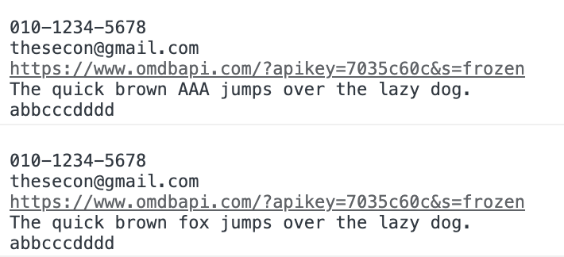

## 메소드


### test

```jsx
const str = `
010-1234-5678
thesecon@gmail.com
https://www.omdbapi.com/?apikey=7035c60c&s=frozen
The quick brown fox jumps over the lazy dog.
abbcccdddd
`

const regexp = /fox/gi
console.log(regexp.test(str))
// true 반환
```

→ fox라는 글자가 있는지 확인하고 `boolean` 데이터로 반환

### replace

```jsx
const str = `
010-1234-5678
thesecon@gmail.com
https://www.omdbapi.com/?apikey=7035c60c&s=frozen
The quick brown fox jumps over the lazy dog.
abbcccdddd
`

const regexp = /fox/gi
console.log(str.replace(regexp, 'AAA'))
console.log(str)
```



→ fox가 AAA로 대체되어 출력

<br/>

다른 방법

```jsx
let str = `
010-1234-5678
thesecon@gmail.com
https://www.omdbapi.com/?apikey=7035c60c&s=frozen
The quick brown fox jumps over the lazy dog.
abbcccdddd
`

const regexp = /fox/gi
str = str.replace(regexp, 'AAA')
console.log(str)
```