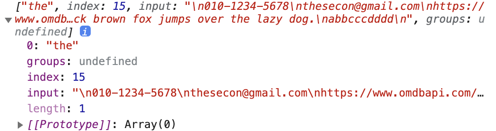
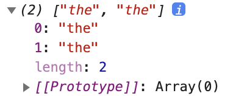
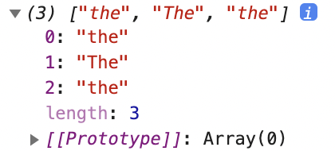

## 정규식

- 문자열을 검색하고 대체하는 데 사용 가능한 일종의 형식 언어(패턴)
- [참고 블로그](https://heropy.blog/2018/10/28/regexp/)

#### 역할
- 문자 검색(search)
- 문자 대체(replace)
- 문자 추출(extract)

#### 테스트 사이트
- [https://regexr.com/](https://regexr.com/)

#### 정규식 생성

```jsx
// 생성자
new RegExp('표현', '옵션')
new RegExp('[a-z]', 'gi')

// 리터럴
/표현/옵션
/[a-z]/gi
```

`main.js` 작성

```jsx
const str = `
010-1234-5678
thesecon@gmail.com
https://www.omdbapi.com/?apikey=7035c60c&s=frozen
The quick brown fox jumps over the lazy dog.
abbcccdddd
`

const regexp = new RegExp('the', '')
console.log(str.match(regexp))
```



→ the라는 단어를 찾아서 배열로 생성

<br/>

### 생성자 방식

the라는 단어를 모두 찾아 배열로 생성

- 옵션: `g`

```jsx
const regexp = new RegExp('the', 'g')
// 옵션 g로 수정
```



대문자와 소문자를 구별하지 않고 검색하고자 할 때

- 옵션: `i`

```jsx
const regexp = new RegExp('the', 'gi')
// 옵션에 i 추가
```



<br/>

### 리터럴 방식

```jsx
const str = `
010-1234-5678
thesecon@gmail.com
https://www.omdbapi.com/?apikey=7035c60c&s=frozen
The quick brown fox jumps over the lazy dog.
abbcccdddd
`

const regexp = /the/gi
console.log(str.match(regexp))
```

