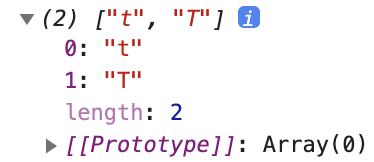
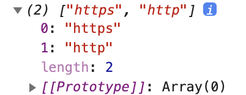

## 패턴(표현)

패턴 | 설명
--|--
[^ab](#ab-1) | 줄(Line) 시작에 있는 ab와 일치
[ab$](#ab) | 줄(Line) 끝에 있는 ab와 일치
[.](#) | 임의의 한 문자와 일치
[a&verbar;b](#ab-2) | a 또는 b와 일치
[ab?](#ab-3) | b가 없거나 b와 일치
[{3}](#n) | 3개 연속 일치
[{3,}](#n-1) | 3개 이상 연속 일치
[{3,5}](#nm) | 3개 이상 5개 이하(3-5개) 연속 일치
[[abc]](#abc)	| a 또는 b 또는 c
[a-z] |	a부터 z 사이의 문자 구간에 일치 (영어 소문자)
[A-Z]	| A부터 Z 사이의 문자 구간에 일치 (영어 대문자)
[0-9]	| 0부터 9 사이의 문자 구간에 일치 (숫자)
[[가-힣]](#가-힣)	| 가부터 힣 사이의 문자 구간에 일치
[\w](#w) | 63개 문자(Word, 대소영문 52개 + 숫자 10개 + _)에 일치
[\b](#b) | 63개 문자에 일치하지 않는 문자 경계(Boundary)
[\d](#d) | 숫자(Digit)에 일치
[\s](#s) | 공백(Space, Tab 등)에 일치
[(?=)](#-1) |	앞쪽 일치(Lookahead)
[(?<=)](#-2) | 뒤쪽 일치(Lookbehind)

### ab$

줄(Line) 끝에 있는 ab와 일치

- 마지막 문자가 d와 일치하는 것 검색

```jsx
let str = `
010-1234-5678
thesecon@gmail.com
https://www.omdbapi.com/?apikey=7035c60c&s=frozen
The quick brown fox jumps over the lazy dog.
abbcccdddd
`

console.log(
  str.match(/d$/g)
  )
```

→ 마지막에 d로 끝나므로 d가 반환될 것으로 예상

→ 결과: `null` 반환

→ 이유: 줄 바꿈을 무시하기 때문에 백틱 기호 바로 앞의 문자가 마지막 글자로 인식됨

- 백틱 기호 바로 앞 문자 d로 입력

```jsx
let str = `
010-1234-5678
thesecon@gmail.com
https://www.omdbapi.com/?apikey=7035c60c&s=frozen
The quick brown fox jumps over the lazy dog.
abbcccdddd
d`

console.log(
  str.match(/d$/g)
  )
```

→ 결과: d 반환

- 줄(Line) 끝에 있는 ab와 일치옵션 `gm`으로 수정

```jsx
console.log(
  str.match(/d$/gm)
  )
```


---

### ^ab

줄(Line) 시작에 있는 ab와 일치

- 시작 문자가 t와 일치하는 것 검색

```jsx
let str = `
010-1234-5678
thesecon@gmail.com
https://www.omdbapi.com/?apikey=7035c60c&s=frozen
The quick brown fox jumps over the lazy dog.
abbcccdddd
d`

console.log(
  str.match(/^t/gm)
  )
```

→ `null` 반환

→ 이유: 대문자가 아닌 소문자만 취급하기 때문

- 옵션 `gim`으로 수정

```jsx
console.log(
  str.match(/^t/gim)
  )
```



- 대문자 T만 출력하고 싶은 경우

```jsx
console.log(
  str.match(/^T/gm)
  )
```

---

### &#46;

임의의 한 문자와 일치

- 모든 문자 출력

```jsx
let str = `
010-1234-5678
thesecon@gmail.com
https://www.omdbapi.com/?apikey=7035c60c&s=frozen
The quick brown fox jumps over the lazy dog.
abbcccdddd
d`

console.log(
  str.match(/./g)
  )
```


- `h..p`로 표현 수정

```jsx
console.log(
  str.match(/h..p/g)
  )
```

→ http 반환

→ h로 시작하고 p로 끝나는 모든 것들 반환

- `str`에 hxyp 추가 후 확인

```jsx
let str = `
010-1234-5678
thesecon@gmail.com
https://www.omdbapi.com/?apikey=7035c60c&s=frozen
The quick brown fox jumps over the lazy dog.
abbcccdddd
hxyp
`

console.log(
  str.match(/h..p/g)
  )
```


→ http, hxyp 두 개의 내용이 검색됨

---

### a|b

a 또는 b와 일치

- fox 또는 dog와 일치하는 것 검색

```jsx
let str = `
010-1234-5678
thesecon@gmail.com
https://www.omdbapi.com/?apikey=7035c60c&s=frozen
The quick brown fox jumps over the lazy dog.
abbcccdddd
hxyp
`

console.log(
  str.match(/fox|dog/g)
  )
```


- 옵션 제거

```jsx
console.log(
  str.match(/fox|dog/)
  )
```

→ fox와 dog 중 먼저 찾아지는 것으로 배열 반환

---

### ab?

b가 없거나 b와 일치

- s가 있을 수도 있고 없을 수도 있는 내용 검색

```jsx
let str = `
010-1234-5678
thesecon@gmail.com
https://www.omdbapi.com/?apikey=7035c60c&s=frozen
The quick brown fox jumps over the lazy dog.
abbcccdddd
http://localhost:1234
`

console.log(
  str.match(/https?/g)
  )
```



---

### {n}

n개 연속 일치

- dd가 두 번 연속되는 것 검색

```jsx
let str = `
010-1234-5678
thesecon@gmail.com
https://www.omdbapi.com/?apikey=7035c60c&s=frozen
The quick brown fox jumps over the lazy dog.
abbcccdddd
http://localhost:1234
`

console.log(
  str.match(/d{2}/g)
  )
```


---

### {n,}

n개 이상 연속 일치

- dd가 2번 이상 연속되는 것 검색

```jsx
let str = `
010-1234-5678
thesecon@gmail.com
https://www.omdbapi.com/?apikey=7035c60c&s=frozen
The quick brown fox jumps over the lazy dog.
abbcccdddd
http://localhost:1234
`

console.log(
  str.match(/d{2,}/g)
  )
```


---

### {n,m}

n개 이상 m개 이하(n-m개) 연속 일치

- 모든 글자(숫자 포함) 중 2개 이상 3개 이하 연속되는 것 검색

```jsx
let str = `
010-1234-5678
thesecon@gmail.com
https://www.omdbapi.com/?apikey=7035c60c&s=frozen
The quick brown fox jumps over the lazy dog.
abbcccdddd
http://localhost:1234
`

console.log(
  str.match(/\w{2,3}/g)
  )
```


- 숫자나 문자가 아닌 것으로 경계 설정

    → 특수문자를 경계 삼아서 검색

```jsx
let str = `
010-1234-5678
thesecon@gmail.com
https://www.omdbapi.com/?apikey=7035c60c&s=frozen
The quick brown fox jumps over the lazy dog.
abbcccdddd
http://localhost:1234
`

console.log(
  str.match(/\b\w{2,3}\b/g)
  )
```


---

### [abc]

a 또는 b 또는 c

- f 또는 o 또는 x 검색

```jsx
let str = `
010-1234-5678
thesecon@gmail.com
https://www.omdbapi.com/?apikey=7035c60c&s=frozen
The quick brown fox jumps over the lazy dog.
abbcccdddd
http://localhost:1234
`

console.log(
  str.match(/[fox]/g)
  )
```


---

### [가-힣]

가부터 힣 사이의 문자 구간에 일치

- 가부터 힣 사이의 문자 구간에서 1개 이상 연속되는 것 검색

```jsx
let str = `
010-1234-5678
thesecon@gmail.com
https://www.omdbapi.com/?apikey=7035c60c&s=frozen
The quick brown fox jumps over the lazy dog.
abbcccdddd
http://localhost:1234
동해물과 백두산이 마르고 닳도록
`

console.log(
  str.match(/[가-힣]{1,}/g)
  )
```


---

### \w

63개 문자(Word, 대소영문 52개 + 숫자 10개 + _)에 일치

```jsx
let str = `
010-1234-5678
thesecon@gmail.com
https://www.omdbapi.com/?apikey=7035c60c&s=frozen
The quick brown fox jumps over the lazy dog.
abbcccdddd
http://localhost:1234
동해물과_백두산이 마르고 닳도록
`

console.log(
  str.match(/\w/g)
  )
```


---

### \b

63개 문자에 일치하지 않는 문자 경계(Boundary)

```jsx
let str = `
010-1234-5678
thesecon@gmail.com
https://www.omdbapi.com/?apikey=7035c60c&s=frozen
The quick brown fox jumps over the lazy dog.
abbcccdddd
http://localhost:1234
동해물과_백두산이 마르고 닳도록
`

console.log(
  str.match(/\b/g)
  )
```


→ 문자와 문자 사이의 경계가 아닌 띄어쓰기와 마침표, @ 문자 등이 경계로 설정됨

- 63개의 문자가 아닌 경계에서 시작하여 f로 시작하며 63개의 문자 중 1개 이상 연속되는 단어 검색

```jsx
let str = `
010-1234-5678
thesecon@gmail.com
https://www.omdbapi.com/?apikey=7035c60c&s=frozen
The quick brown fox jumps over the lazy dog.
abbcccdddd
http://localhost:1234
동해물과_백두산이 마르고 닳도록
`

console.log(
  str.match(/\bf\w{1,}\b/g)
  )
```


---

### \d

숫자(Digit)에 일치

```jsx
let str = `
010-1234-5678
thesecon@gmail.com
https://www.omdbapi.com/?apikey=7035c60c&s=frozen
The quick brown fox jumps over the lazy dog.
abbcccdddd
http://localhost:1234
동해물과_백두산이 마르고 닳도록
`

console.log(
  str.match(/\d{1,}/g)
  )
```


---

### \s

공백(Space, Tab 등)에 일치

```jsx
let str = `
010-1234-5678
thesecon@gmail.com
https://www.omdbapi.com/?apikey=7035c60c&s=frozen
The quick brown fox jumps over the lazy dog.
abbcccdddd
http://localhost:1234
동해물과_백두산이 마르고 닳도록
`

console.log(
  str.match(/\s/g)
  )
```


- 공백 제거

```jsx
const h = `  the hello world  !

`

console.log(
  h.replace(/\s/g, '')
  )
```


---

### (?=)

앞쪽 일치(Lookahead)

- 모든 문자를 대상으로 1개 이상 연속되며 @ 앞에 있어야 함

```jsx
let str = `
010-1234-5678
thesecon@gmail.com
https://www.omdbapi.com/?apikey=7035c60c&s=frozen
The quick brown fox jumps over the lazy dog.
abbcccdddd
`
console.log(
  str.match(/.{1,}(?=@)/g)
)
```


---

### (?<=)

뒤쪽 일치(Lookbehind)

- 모든 문자를 대상으로 1개 이상 연속되며 @ 뒤쪽의 단어 출력

```jsx
let str = `
010-1234-5678
thesecon@gmail.com
https://www.omdbapi.com/?apikey=7035c60c&s=frozen
The quick brown fox jumps over the lazy dog.
abbcccdddd
`
console.log(
  str.match(/(?<=@).{1,}/g)
)
```


