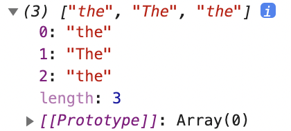

## 플래그(옵션)

```jsx
let str = `
010-1234-5678
thesecon@gmail.com
https://www.omdbapi.com/?apikey=7035c60c&s=frozen
The quick brown fox jumps over the lazy dog.
abbcccdddd
`

const regexp = /the/gi
console.log(str.match(regexp))
```



→ the이면서 대문자 소문자 모두 검색

리터럴 형식

```jsx
console.log(str.match(/the/gi))
```

---

```jsx
let str = `
010-1234-5678
thesecon@gmail.com
https://www.omdbapi.com/?apikey=7035c60c&s=frozen
The quick brown fox jumps over the lazy dog.
abbcccdddd
`

console.log(str.match(/\.$/gi))
// null
```

→ `$` 앞 단어의 줄이 끝나는 부분을 찾아 그 부분을 일치시키는 것

→ 백틱 기호 앞의 내용이 끝나는 부분

→ 백틱 기호 줄에는 내용이 없으므로 `null` 반환

```jsx
let str = `
010-1234-5678
thesecon@gmail.com
https://www.omdbapi.com/?apikey=7035c60c&s=frozen
The quick brown fox jumps over the lazy dog.
abbcccdddd
`

console.log(str.match(/\.$/gim))
```


