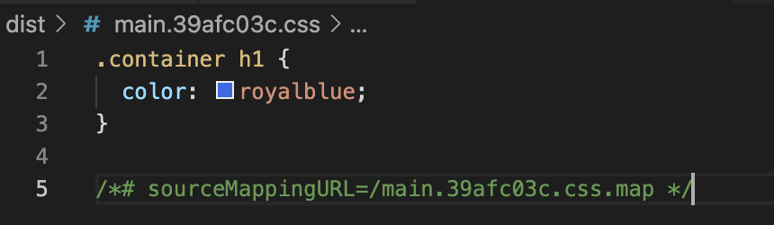

## 개요

Sass는 기존 css와 호환되지 않는 부분이 있으므로 SCSS 사용

[Sass에 대한 문서](https://sass-lang.com/)

- CSS

```css
body {
  font: 100% Helvetica, sans-serif;
  color: #333;
}
```

- Sass

```sass
$font-stack:    Helvetica, sans-serif
$primary-color: #333

body
  font: 100% $font-stack
  color: $primary-color
```

- SCSS

```scss
$font-stack:    Helvetica, sans-serif;
$primary-color: #333;

body {
  font: 100% $font-stack;
  color: $primary-color;
}
```

→ 세미콜론이나 중괄호 사용 등 특정 문법 이외에는 Sass와 기능 동일

<br/>

ex2)

```scss
/* SCSS SYNTAX */
@mixin theme($theme: DarkGray) {
  background: $theme;
  box-shadow: 0 0 1px rgba($theme, .25);
  color: #fff;
}

.info {
  @include theme;
}
.alert {
  @include theme($theme: DarkRed);
}
.success {
  @include theme($theme: DarkGreen);
}
```

```css
/* CSS */
.info {
  background: DarkGray;
  box-shadow: 0 0 1px rgba(169, 169, 169, 0.25);
  color: #fff;
}

.alert {
  background: DarkRed;
  box-shadow: 0 0 1px rgba(139, 0, 0, 0.25);
  color: #fff;
}

.success {
  background: DarkGreen;
  box-shadow: 0 0 1px rgba(0, 100, 0, 0.25);
  color: #fff;
}
```

Sass를 사용하는 이유 중 하나: 중첩 기능

→ 코딩은 Sass로, 동작은 표준 css로 변환하여 사용

→ css의 전처리 도구라고 부름

→ 이외에도 less와 stylus 등의 기능이 있음

### 프로젝트 생성

```bash
npm init -y  # package.json 파일 생성
npm i -D parcel bundler  # node_modules와 package-lock.json 파일 생성
```

```json
// package.json 수정

"scripts": {
    "dev": "parcel index.html",
    "build": "parcel build index.html"
  },
```

<br/>

```html
<!DOCTYPE html>
<html lang="en">
<head>
  <meta charset="UTF-8">
  <meta http-equiv="X-UA-Compatible" content="IE=edge">
  <meta name="viewport" content="width=device-width, initial-scale=1.0">
  <title>Document</title>
  <link rel="stylesheet" href="./main.scss" />
</head>
<body>
  <div class="container">
    <h1>Hello SCSS!</h1>
  </div>
</body>
</html>
```

```scss
$color: royalblue;

.container {
  h1 {
    color: $color;
  }
}

/* 중첩 기능 사용 */
```




→ dist 폴더 안의 css 파일에서 css 문법대로 작성되어져 있는 것 확인 가능