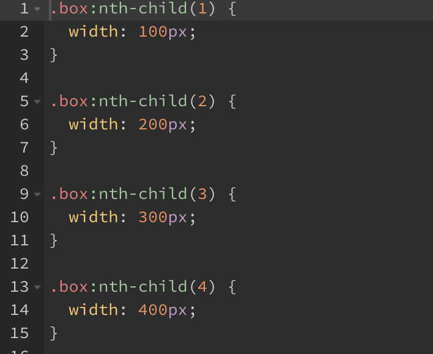

## 반복문

```scss
// for (let i=0; i<10; i+=1) {
//   console.log(`loop-${i}`)
// }

@for $i from 1 through 10 {
    .box:nth-child() {
        width: 100px;
    }
}
```

→ 선택자에는 i라는 변수를 그대로 삽입할 수 없음

보간을 이용한 방법으로 해결

- JS의 ``loop-${i}``와 같은 방법
- $ 사인 대신 # 사용

```scss
@for $i from 1 through 10 {
    .box:nth-child(#{$i}) {
        width: 100px;
    }
}
```


값을 적는 부분에는 보간 처리 할 필요 없음

```scss
@for $i from 1 through 10 {
    .box:nth-child(#{$i}) {
        width: 100px * $i;
    }
}
```



## 반복문 @each

`list` 데이터로 반복문 생성

```scss
$list: orange, royalblue, yellow;

@each $c in $list {
    .box {
        color: $c;
    }
}
```

→ `list`라는 변수에 있는 해당 데이터드를 반복적으로 c라는 변수에 넣어서 처리하겠다는 뜻


<br/>

`map` 데이터로 반복문 생성

```scss
$map: (
    o: orange,
    r: royalblue,
    y: yellow
);

@each $k, $v in $map {
    .box-#{$k} {
        color: $v;
    }
}
```

→ `map` 데이터는 key value 형태이므로 `@each` 키워드를 통해 `key`와 `value` 입력해야 함