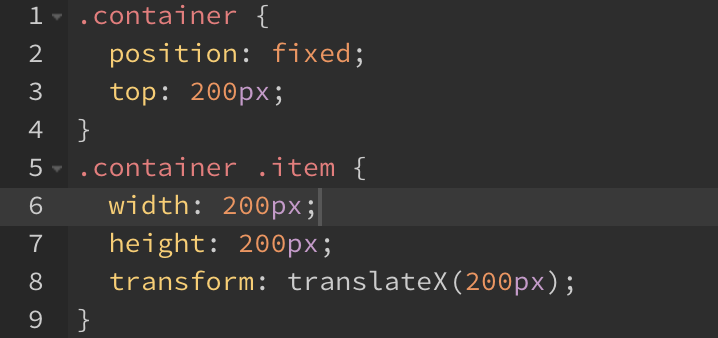
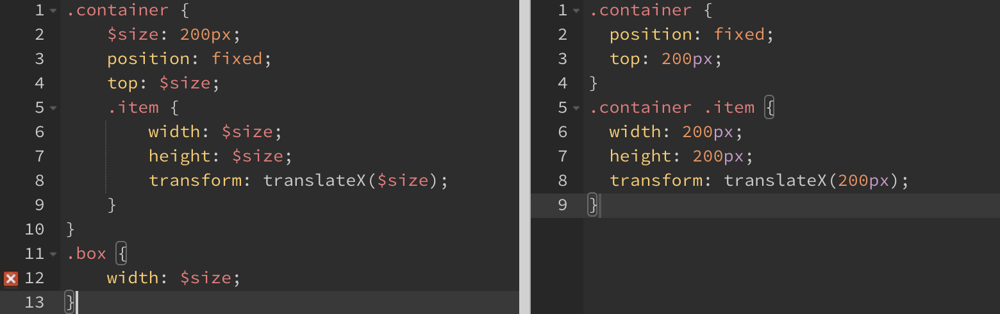
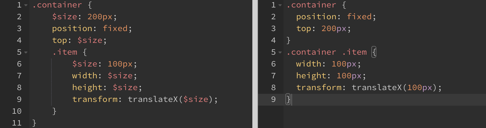

## 변수

JS의 `let`과 동일하게 재할당이 가능

```scss
$size: 200px;

.container {
  position: fixed;
  top: $size;
  .item {
		width: $size;
    height: $size;
    transform: translateX($size);
    }
}
```

- 변환된 CSS



<br/>

유효범위

- `container` 윗부분 삽입: 전체 영역에서 사용할 수 있는 전역 변수
- `container` 내부: 변수가 선언된 중괄호 안에서만 사용





→ `item` 안에서는 `$size`가 100px로 재할당되었기 때문에 item부터는 100px로 값 변경