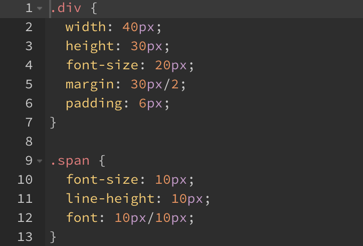
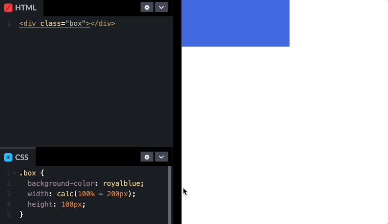

## 산술 연산

```scss
.div {
  width: 20px + 20px;
  height: 40px - 10px;
  font-size: 10px * 2;
  margin: 30px / 2;
  padding: 20px % 7;
}
.span {
  font-size: 10px;
  line-height: 10px;
  font: 10px / 10px;
}
```

- 변환된 CSS



→ 나누기 연산자 `/`는 계산되지 않고 그대로 출력

→ `/`는 단축 속성을 의미하기 때문

해결

- `margin: (30px / 2);`처럼 괄호로 묶어서 연산
- 변수 이용

```scss
.div {
  $size: 30px;
  width: 20px + 20px;
  height: 40px - 10px;
  font-size: 10px * 2;
  margin: $size / 2;  // 15px
  padding: 20px % 7;
}
```

- 다른 연산자와 함께 사용

```scss
.div {
	$size: 30px;
  width: 20px + 20px;
  height: 40px - 10px;
  font-size: 10px * 2;
  margin: 10px + 12px / 2;  // 16px	
	// 우선순위에 의해 +를 먼저 계산하고 싶은 경우 () 사용
	// (10px + 12px) / 2
  padding: 20px % 7;
}

```

SCSS에서 다른 단위끼리 연산은 불가능하나 CSS에서 `calc()` 함수를 이용하여 연산 가능

- `calc(100% - 200px);`
    - 100% 가로 너비에서 창 크기를 변화시켜도 200px를 뺀 크기의 박스 출력

