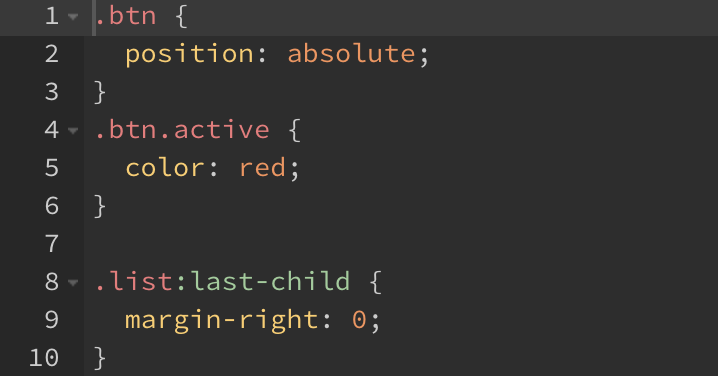
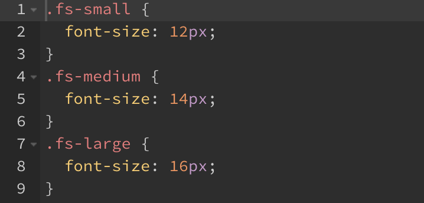

## 상위(부모) 선택자 참조

&: 상위 선택자 참조

- 자신이 포함된 영역의 상위 선택자를 참조
- 상위 선택자가 하위 선택자에 & 기호로 치환됨

ex 1)

```scss
.btn {
  position: absolute;
  &.active {
    color: red;
  }
}

.list {
  &:last-child {
    margin-right: 0;
  }
}
```

- 변환된 CSS



ex2)

```scss
.fs {
  &-small { font-size: 12px; }
  &-medium { font-size: 14px; }
  &-large { font-size: 16px; }
}
```

- 변환된 CSS


