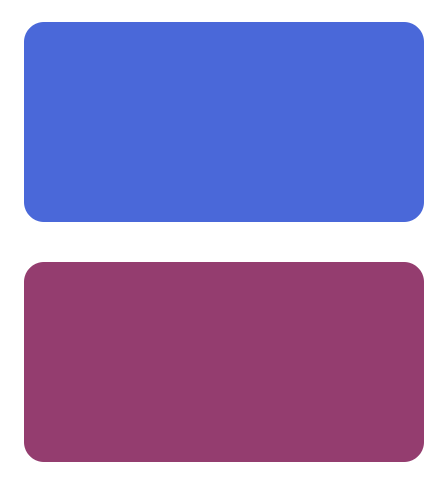
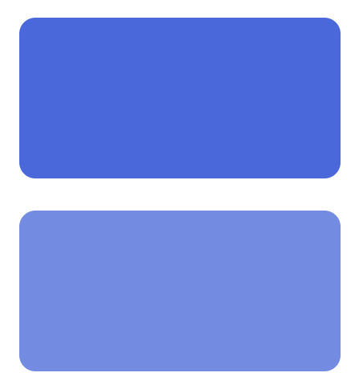
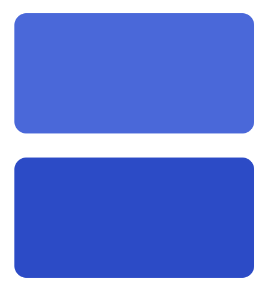
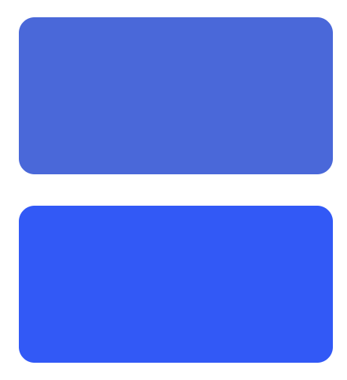
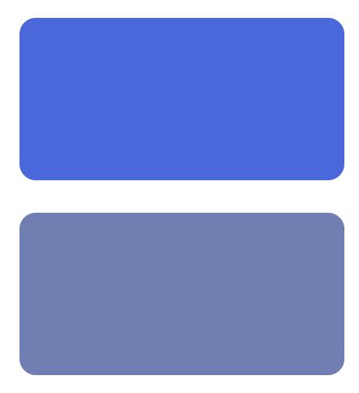
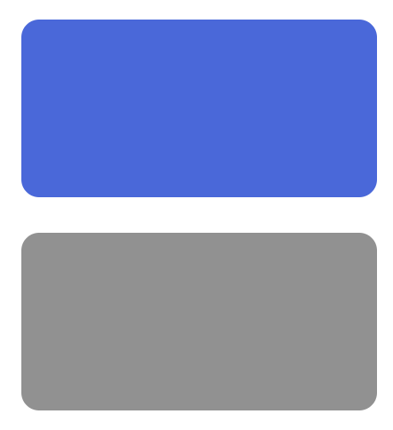
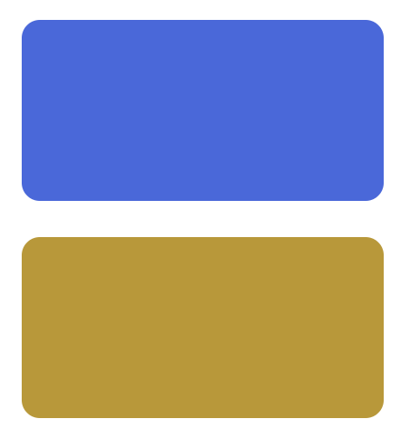
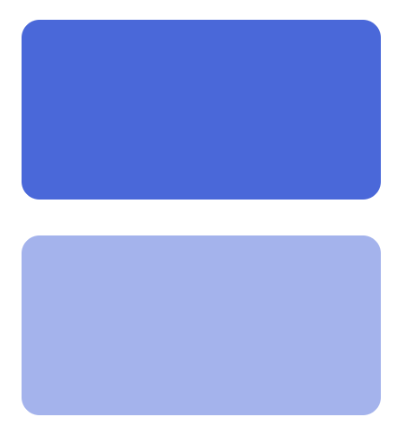

## 색상 내장 함수

### mix()

- 지정한 색을 혼합

```scss
.box {
  $color: royalblue;
  width: 200px;
  height: 100px;
  margin: 20px;
  border-radius: 10px;
  background-color: $color;
  &.built-in {
    background-color: mix($color, red);
		// royalblue와 red를 혼합한 색 표시
  }
}
```




### lighten()

- 지정한 수치만큼 색상의 밝기를 높임

```scss
.box {
  $color: royalblue;
  width: 200px;
  height: 100px;
  margin: 20px;
  border-radius: 10px;
  background-color: $color;
  &.built-in {
    background-color: lighten($color, 10%);
		// 밝기 10% 올림
  }
}
```



### darken()

- 지정한 수치만큼 색상의 밝기를 낮춤

```scss
.box {
  $color: royalblue;
  width: 200px;
  height: 100px;
  margin: 20px;
  border-radius: 10px;
  background-color: $color;
  &.built-in {
    background-color: darken($color, 10%);
		// 밝기 10% 낮춤
  }
}
```



### saturate()

- 지정 수치만큼 채도를 높임

```scss
.box {
  $color: royalblue;
  width: 200px;
  height: 100px;
  margin: 20px;
  border-radius: 10px;
  background-color: $color;
  &:hover {
    background-color: darken($color, 10%);
  }
  &.built-in {
    background-color: saturate($color, 40%);
		// 채도 40% 올림
  }
}
```



### desaturate()

- 지정 수치만큼 채도를 낮춤

```scss
.box {
  $color: royalblue;
  width: 200px;
  height: 100px;
  margin: 20px;
  border-radius: 10px;
  background-color: $color;
  &:hover {
    background-color: darken($color, 10%);
  }
  &.built-in {
    background-color: desaturate($color, 40%);
	  // 채도 40% 낮춤
	}
}
```




### grayscale()

- 색상을 회색으로 만듦

```scss
.box {
  $color: royalblue;
  width: 200px;
  height: 100px;
  margin: 20px;
  border-radius: 10px;
  background-color: $color;
  &:hover {
    background-color: darken($color, 10%);
  }
  &.built-in {
    background-color: grayscale($color);
  }
}
```



### invert()

- 색상을 반전시킴

```scss
.box {
  $color: royalblue;
  width: 200px;
  height: 100px;
  margin: 20px;
  border-radius: 10px;
  background-color: $color;
  &:hover {
    background-color: darken($color, 10%);
  }
  &.built-in {
    background-color: invert($color);
  }
}
```



### rgba()

```scss
.box {
  $color: royalblue;
  width: 200px;
  height: 100px;
  margin: 20px;
  border-radius: 10px;
  background-color: $color;
  &:hover {
    background-color: darken($color, 10%);
  }
  &.built-in {
    background-color: rgba($color, .5);
		// 50% 투명해짐
  }
}
```



→ CSS: `rgba(red, green, blue, alpha)` 입력

→ SCSS: `rgba(color, alpha)` 입력