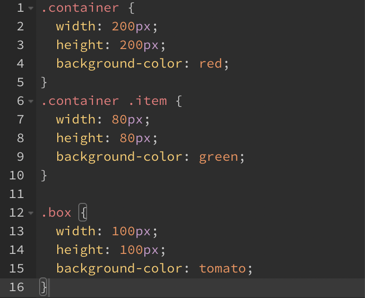

## @mixin

```scss
@mixin center {
  display: flex;
  justify-content: center;
  align-items: center;
}
.container {
  @include center;
  .item {
    @include center;
  }
}
.box {
  @include center;
}
```


→ `@mixin 이름` 형태로 재사용할 코드 정의

→ `@include 이름` 형태로 재사용

<br/>

속성을 유동적으로 변경하여 사용하고 싶은 경우

- 변수 사용
- `$size`는 매개변수와 같은 기능

```scss
@mixin box($size) {
  width: $size;
  height: $size;
  background-color: tomato;
}
.container {
  @include box(200px);
  .item {
    @include box(100px);
  }
}
.box {
  @include box(100px);
}
```

- 변환된 CSS


<br/>

변수에 기본값 지정

- 따로 기본값을 지정하지 않을 경우에 100px 입력

```scss
@mixin box($size: 100px) {
  width: $size;
  height: $size;
  background-color: tomato;
}
.container {
  @include box(200px);
  .item {
		@include box;
  }
}
.box {
  @include box;
}
```

- 변환된 CSS


→ `.container`: `box(200px)`로 지정했으므로 200px 입력

→ `.item` `.box`: 인수 입력하지 않았으므로 기본값 100px 자동 입력

매개변수 추가

- $color

```scss
@mixin box($size: 80px, $color: tomato) {
  width: $size;
  height: $size;
  background-color: $color;
}
.container {
  @include box(200px, red);
  .item {
    @include box(80px, green);
  }
}
.box {
  @include box(100px);
}
```

- 변환된 CSS



→ `box(200px, red)`로 지정했으므로 두 번째 인수에 기본값인 tomato가 아닌 red 입력됨

→ `@include box(80px, green);` 에서 첫 번째 인수를 생략할 경우 `width`와 `height`에도 green이 입력되므로 두 번째 인수 값 변경 시 앞에 있는 인수의 값 정확히 명시

- **키워드 인수**로 표기 가능

```scss
.container {
  @include box(200px, red);
  .item {
    @include box($color: green); 
		// 변수 사용으로 앞 인수 생략 가능
  }
}
```

<br/>

## @content

```scss
@mixin left-top {
    position: absolute;
    top: 0;
    left: 0;
    @content;
}
.container {
    width: 100px;
    height: 100px;
    @include left-top;
}
.box {
    width: 200px;
    height: 300px;
    @include left-top {
        bottom: 0;
        right: 0;
        margin: auto;
    }
}
```


→ 필요에 따라 `@mixin`에 추가적인 내용을 더 입력하여 사용할 수 있음

→ `.box` 안의 `@include left-top` 이후의 내용들을 `@mixin` 안의 `@content` 부분으로 가지고 옴