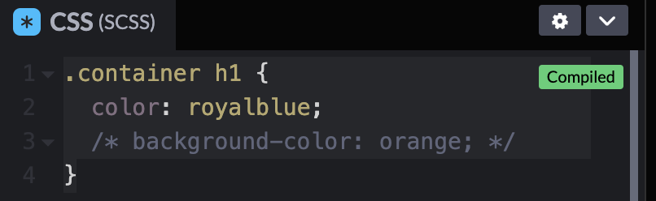

## 주석

```html
<div class="container">
  <h1>Hello SCSS!</h1>
</div>
```

```scss
.container {
  h1 {
    color: royalblue;
    /* background-color: orange; */
    // font-size: 60px;
  }
}
```


→ SCSS에서는 CSS와 다르게 `/**/` 뿐만 아닌 `//`으로도 주석 사용 가능

- View Compiled CSS



→ SCSS 코드로 `//`로 표기한 주석을 CSS로 변환하지 않음

→ 주석을 두 가지 방법으로 제공하기는 하나 둘 다 컴파일되지는 않음, `/**/`만 변환

→ CSS 파일에도 남겨져 있어야 하는 내용이라면 `/**/` 사용, 그렇지 않을 경우에는 `//` 사용해도 무방