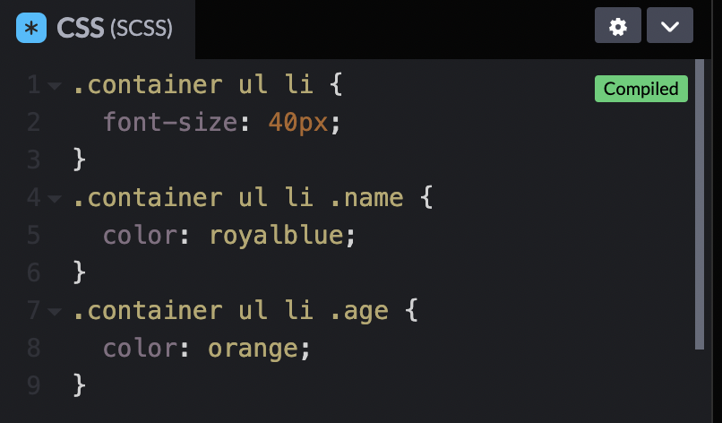
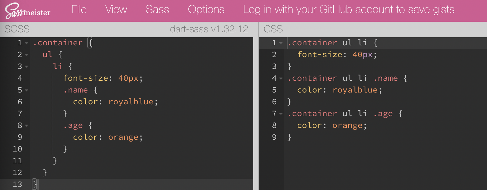
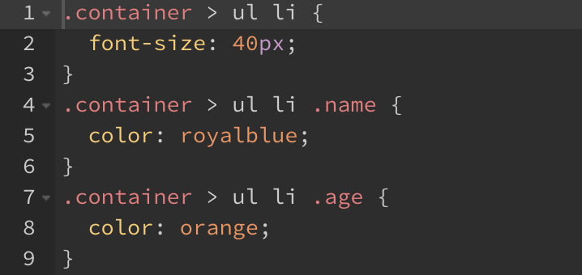
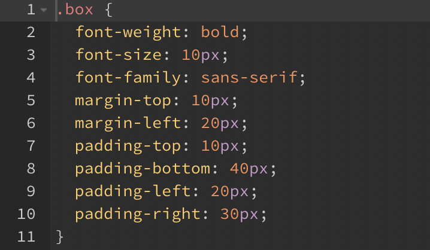

## 중첩

```html
<div class="container">
  <ul>
    <li>
      <div class="name">HEROPY</div>
      <div class="age">85</div>
    </li>
  </ul>
</div>
```

```scss
.container {
  ul {
    li {
      font-size: 40px;
      .name {
        color: royalblue;
      }
      .age {
        color: orange;
      }
    }
  }
}
```

- View Compiled CSS




[SassMeister](https://www.sassmeister.com/)에서 편리하게 편집 가능



후손 선택자가 아닌 자식 선택자 사용할 경우

- `>` 삽입

```scss
.container {
	> ul {
    li {
      font-size: 40px;
      .name {
        color: royalblue;
      }
      .age {
        color: orange;
      }
    }
  }
}
```

- css로 변환, 자동으로 `>` 삽입



<br/>

## 중첩된 속성

```scss
.box {
	font: {
		weight: bold;
    size: 10px;
    family: sans-serif;
  };
  margin: {
    top: 10px;
    left: 20px;
  };
  padding: {
    top: 10px;
    bottom: 40px;
    left: 20px;
     right: 30px;
  };
}
```

- 변환된 CSS




예를 들어 `font-weight`, `font-size`, `font-family` 처럼 `font-`로 시작하는 속성들에 대해 네임스페이스가 동일하다고 지칭(`margin-top`, `margin-bottom`도 `margin-`이 반복)

- 네임스페이스: 이름을 통해 구분 가능한 범위를 만들어 내는 것으로 일종의 유효 범위 지정하는 방법
- 이름 부분이 동일하다는 뜻