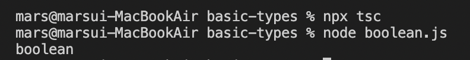

## boolean

참과 거짓을 나타내는 타입

```tsx
let isDone: boolean = false;

isDone = true;

console.log(typeof isDone); // 'boolean'
```

→ isDone을 `Primitive` 타입으로 선언

→ isDone의 타입을 확인할 수 있는 `typeof` 사용 시 `boolean` 반환



<br/>

```tsx
let isOk: Boolean = true;
let isNotOk: boolean = new Boolean(true);
```

→ 첫 줄에서는 `Primitive` 타입 선언이나 `boolean`을 대문자로 표기했기 때문에 틀린 선언

→ 둘째 줄에서는 래퍼 객체 생성식이며 이러한 방식은 잘 사용하지 않음

<br/>

## number

숫자를 나타내는 가장 기본적인 타입

- JavaScript와 같이 TypeScript의 모든 숫자는 부동소수점값
- TypeScript는 16진수 및 10진수 리터럴 외에도 ECMAScript 2015에 도입된 2진수 및 8진수를 지원
- Nan, 1_000_000와 같은 표기 가능

```tsx
let decimal: number = 6;  // 10진수 리터럴

let hex: number = 0xf00d; // 16진수 리터럴

let binary: number = 0b1010;  // 2진수 리터럴

let octal: number = 0o744;  // 8진수 리터럴

let notANumber: number = NaN; // 숫자가 아닌 값

let underscoreNum: number = 1_000_000;
```

<br/>

## string

텍스트 형식을 참조

- JavaScript와 마찬가지로 TypeScript는 문자열 데이터를 둘러싸기 위해 큰 따옴표("")나 작은 따옴표('')를 사용

```tsx
let myName: string = 'Mark';  // 작은따옴표 사용
myName = "Anna"; // 큰따옴표 사용
```

### Template String

- 행에 걸쳐 있거나 표현식을 넣을 수 있는 문자열
- 백틱 기호에 둘러싸여 있음
- 포함된 표현식은 ``${expr}`` 와 같은 형태로 사용

```tsx
let fullName: string = `Bob Bobbington`;
let age: number = 38;

let sentence: string = `Hello, my name is ${ fullName }.
I'll be ${ age+1 } years old next month.`;

// template string을 사용하지 않을 경우
let sentence: string = "Hello, my name is " + fullName + ".\n\n" +
"I'll be " + ( age +1 ) + " years old next month.";
```

