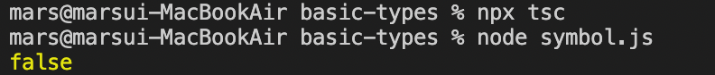

## symbol

ECMAScript 2015에 추가된 타입

- `new Symbol`로 사용할 수 없음
- `Symbol`을 함수로 사용하여 `symbol` 타입을 만들어 낼 수 있음
- 함수로 사용 시 대문자, 타입으로 사용 시 소문자 사용

#### 특징

- `Primitive` 타입의 값을 담아서 사용
- 고유하고 수정 불가능한 값으로 만들어 줌
- 주로 접근 제어에 사용

---

ex 1)

```tsx
console.log(Symbol('foo'));
// 오류 발생
```

→ `Symbol`을 사용할 수 있는 TypeScript 환경이 아님

<br/>

사용 환경 수정

- tsconfig.json

```tsx
"lib": ["ES2015", "DOM"]
// 주석 해제 후 해당 내용 입력
```

예제 입력

```tsx
console.log(Symbol("foo") === Symbol("foo"));
```



<br/>

ex 2) 접근 제어 관련

```tsx
const sym = Symbol();

const obj = {
  [sym]: "value"
};

obj[sym] // obj["sym"]와 같이 문자열로 접근 불가능
```

## null & undefined

각각 `undefined` 및 `null`이라는 타입을 가짐

- `void`와 마찬가지로 그 자체로는 유용하지 않음
- 둘 다 소문자만 존재
    - 타입도 소문자, 값도 소문자 사용

설정하지 않고 사용 시 모든 타입의 서브 타입으로 존재하게 됨

- `number`에 `null` 또는 `undefined`를 할당할 수 있다는 의미
- 컴파일 옵션에서 `—strictNullChecks` 사용하면 `null`과 `undefined`는 `void`나 자기 자신에게만 할당 가능
    - 이 경우에 `null`과 `undefined`를 할당할 수 있게 하려면 `union type` 사용

```tsx
let MyName: string = null;
// 오류 발생, strict null check 설정이 켜져 있다는 의미
```

→ `tsconfig.json` 파일에서 `strict: true` 줄을 주석 처리하면 해결되나, `strict: true`는 늘 존재해야 함

→ `null`을 할당할 수 없다는 뜻

<br/>

```tsx
let v: void = undefined;

let union: string | null = null; // union 타입 사용법

union = "Mark";
```

### JavaScript에서의 null과 undefined

#### null

- `null`이라는 값으로 할당된 것
- 무언가가 있으나 사용 준비가 덜 된 상태
- `null` 타입은 `null` 값만 가질 수 있음
- 런타임에서 `typeof` 연산자를 이용하면 `object` 반환

#### undefined

- 값을 할당하지 않은 변수
- 무언가가 아예 준비되지 않은 상태
- `object`의 `property`가 없을 때도 `undefined`
- 런타임에서 `typeof` 연산자를 이용하면 `undefined` 반환

## object

직접 값을 가지고 있지 않고 값을 가지는 곳을 가리키는 정보를 포함

```tsx
// create by object literal
const person1 = { name: 'Mark', age: 39 };

// person1 is not "object" type
// person1 is "{ name: 'Mark', age: 39 }" type

// create by Object.create
const person2 = Object.create({ name: 'Mark', age: 39 });
```

`Primitive Type`이 아닌 것을 나타내고 싶을 때 사용하는 타입

- `number`, `string`, `boolean`, `bigint`, `symbol`, `null`, `undefined`

```tsx
let obj: object = {};

obj = {name: 'Mark'};
obj = [{name:'Mark'}];

obj = 39; // Error
obj = 'Mark'; // Error
obj = true; // Error
obj = 100n; // Error
obj = Symbol(); // Error
obj = null; // Error
obj = undefined; // Error
```

```tsx
declare function create(o: object | null): void;

create({ prop: 0 });
create(null);

create(42); // Error
create("string"); // Error
create(false);  // Error
create(undefined);  // Error

// Object.create
Object.create(0); // Error
```