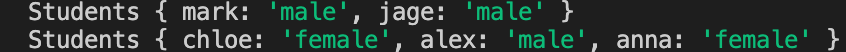

## Index Signatures in class

프로퍼티가 동적으로 들어오는 경우에 유용한 기능

```tsx
// class => object
// { mark: 'male', jade: 'male }
// { chloe: 'female', alex: 'male',n anna: 'female' }

class Students {
  // mark: string = "male";과 같은 구문은 동적 프로퍼티 생성에 적합하지 않음
  [index: string]: string;
}

const a = new Students();
a.mark = "male";
a.jage = "male";

console.log(a);

const b = new Students();
b.chloe = "female";
b.alex = "male";
b.anna = "female";

console.log(b);
```



정해진 값으로만 출력하고 싶은 경우

```tsx
class Students {
  [index: string]: "male" | "female";
}
```

→ male 또는 female 둘 중 하나로만 입력할 수 있음