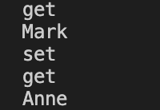

## Getters & Setters

get과 set

```tsx
class Person {
  public constructor(public name: string, age: number) {}
}

const p1: Person = new Person("Mark", 39);
console.log(p1.name); // get
p1.name = 'Anne'; // set
```

**getter**: `get` 수행하는 함수

**setter**: `set` 수행하는 함수

```tsx
class Person {
  public constructor(public _name: string, age: number) {}

  get name() {
    console.log("get");
    return this._name;  // get 되는 곳
  }

  set name(n: string) {
    console.log("set");
    this._name = n; // 호출 되는 곳
  }
}

const p1: Person = new Person("Mark", 39);
console.log(p1.name); // get
p1.name = 'Anne'; // set
console.log(p1.name)
```



→ `get`에서 Mark를 가지고 오고 set 이후 Anne를 get 해 오는 걸 확인 가능

<br/>

```tsx
class Person {
  public constructor(public _name: string, private age: number) {}

  get name() {
    return this._name + " Lee";  // get 되는 곳
  }

  set name(n: string) {
    this._name = n; // 호출 되는 곳
  }
}

const p1: Person = new Person("Mark", 39);
console.log(p1.name); // get
p1.name = 'Anne'; // set
console.log(p1.name)
```

