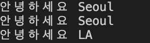

## Static Properties & Methods

```tsx
class Person {
  private static CITY = "Seoul";
  public static hello() {
    console.log("안녕하세요", Person.CITY);
  }
}

const p1 = new Person();

Person.hello();
```


→ class로부터 만들어진 object 중 공통적으로 사용하고 싶은 데이터가 있을 경우 static 키워드 사용

데이터 공유

```tsx
class Person {
  private static CITY = "Seoul";
  public hello() {
    console.log("안녕하세요", Person.CITY);
  }
  public change() {
    Person.CITY = "LA";
  }
}

const p1 = new Person();
p1.hello(); // 안녕하세요 Seoul

const p2 = new Person();
p2.hello();  // 안녕하세요 Seoul
p1.change();  // CITY를 LA로 변경
p2.hello();  // 안녕하세요 LA
```

