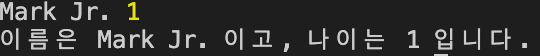

## 상속(Inheritance)

부모 클래스의 기능을 그대로 물려받아 기능을 추가하거나 덮어씌워서 사용할 수 있음

```tsx
class Parent {
  constructor(protected _name: string, private _age: number) {}
  public print(): void {
    console.log(`이름은 ${this._name} 이고, 나이는 ${this._age} 입니다.`);
  }
}

const p = new Parent("Mark", 39);
p.print();
```

출력: 이름은 Mark 이고, 나이는 39 입니다.

<br/>

```tsx
class Parent {
  constructor(protected _name: string, private _age: number) {}
  public print(): void {
    console.log(`이름은 ${this._name} 이고, 나이는 ${this._age} 입니다.`);
  }
}

class Child extends Parent {}

const c = new Child("Son", 5);
c.print();
```

→ 자식 클래스에 아무런 추가 기능 없이 작성할 경우 부모 클래스의 내용을 그대로 가지고 옴

→ 부모의 생성자 구조를 따라야 함

→ `protected`로 인해 `p._name`으로 접근이 불가능하므로 print로 출력

출력: 이름은 Son 이고, 나이는 5 입니다.

<br/>

### Override

```tsx
class Parent {
  constructor(protected _name: string, private _age: number) {}
  public print(): void {
    console.log(`이름은 ${this._name} 이고, 나이는 ${this._age} 입니다.`);
  }
}

class Child extends Parent {
  public _name = "Mark Jr.";
  public gender = "male";
}

const c = new Child("Son", 5);
c._name;
```

→ 부모의 `_name`에서 `protected`로 밖에서 접근 못 하게 지정했으나 자식 클래스에서 `public`으로 `override` 작성하여 접근 가능하도록 함

<br/>

```tsx
class Child extends Parent {
  public _name = "Mark Jr.";
  public gender = "male";

  constructor(age: number) {
    super("Mark Jr.", age);
  }
}

const c = new Child(5);
c.print();
```

→ 자식 클래스는 부모 클래스의 생성자를 호출해 주어야 함

→ 키워드 `super`를 사용하여 부모 클래스 생성자 구조에 맞춰서 호출해야 함

→ 자식 클래스로 값 전달할 때는 자식 클래스의 구조에 맞추어서 변경

출력: 이름은 Mark Jr. 이고, 나이는 5 입니다.

<br/>

```tsx
class Parent {
  constructor(protected _name: string, private _age: number) {}
  public print(): void {
    console.log(`이름은 ${this._name} 이고, 나이는 ${this._age} 입니다.`);
  }

  protected printName(): void {
    console.log(this._name, this._age);  // Mark Jr. 1
  }
}

class Child extends Parent {
  public gender = "male";

  constructor(age: number) {
    super("Mark Jr.", age);
    this.printName();
  }
}

const c = new Child(1);
c.print();  // 이름은 Mark Jr. 이고, 나이는 1 입니다.
```



→ 자식 생성자에서는 `super`를 항상 먼저 호출해야 함