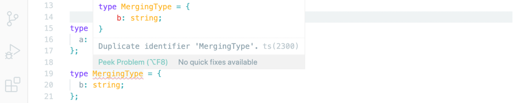

## type alias vs interface

### function

```tsx
// type alias
type EatType = (food: string) => void;

// interface
interface IEat {
  (food: string): void;
}
```

→ `alias`: 타입 뒤에 함수 타입 이름을 붙임

→ `interface`: 인터페이스 선언 후 안에다 함수 형태 갖춤

<br/>

### array

```tsx
// type alias
type PersonList = string[];

// interface
interface IPersonList {
  [index: number]: string;
}
```

→ `alias`: 별칭만 지정

→ `interface`: indexable 타입을 `number`로 지정([0], [1] 처럼 사용), `string` 타입의 데이터 저장으로 배열 사용

<br/>

### intersection

```tsx
interface ErrorHandling {
  success: boolean;
  error?: { message: string };
}

interface ArtistsData {
  artists: { name: string }[];
}

// type alias
type ArtistsResponseType = ArtistsData & ErrorHandling;

// interface
interface IArtistsResponse extends ArtistsData, ErrorHandling {}

let art: ArtistsResponseType;
let iar: IArtistsResponse;
```

→ `alias`: 앰퍼샌드으로 `intersection` 사용

→ `interface`: 다중 상속 방식으로 표현 가능

<br/>

### union types

```tsx
interface Bird {
  fly(): void;
  layEggs(): void;
}

interface Fish {
  swim(): void;
  layEggs(): void;
}

type PetType = Bird | Fish;

interface IPet extends PetType {} // error TS2312: An interface can only extend an object type or intersection of object types with statically known members.

class Pet implements PetType {} // error TS2422: A class can only implement an object type or intersection of object types with statically known members.
```

→ `alias`: | 사용하여 표현

→ `interface`: 인터페이스 상속 불가능, 클래스에게도 `implements`로 넣어 주기도 불가능  
인터페이스에서 `union type`은 표현하기 어렵다는 의미

<br/>

### Declaraiton Merging

- **interface**

```tsx
interface MergingInterface {
  a: string;
}

interface MergingInterface {
  b: string;
}

let mi: MergingInterface;
mi.
```


→ `MergingInterface`를 사용할 때는 선언이 하나로 합쳐져서 실행

→ merging 되었기 때문에 a, b 모두 출력

- **alias**

```tsx
type MergingType = {
  a: string;
};

type MergingType = {
  b: string;
};
```



→ `alias`에서는 불가능