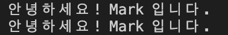

## function

인터페이스 안에서의 함수 선언

```tsx
interface Person4 {
  name: string;
  age: number;
  hello(): void;
}

const p41: Person4 = {
  name: 'Mark',
  age: 35,
  hello: function (): void {
      console.log(`안녕하세요! ${this.name} 입니다.`);
  }
};

const p42: Person4 = {
  name: 'Mark',
  age: 35,
  hello(): void {
      console.log(`안녕하세요! ${this.name} 입니다.`);
  }
};

// const p43: Person4 = {
//   name: 'Mark',
//   age: 35,
//   hello: (): void => {
//       console.log(this);
//       console.log(`안녕하세요! ${this.name} 입니다.`);
//   } 
//   // Error 화살표 함수 안에서는 this 사용할 수 없음
//   // 전역 this를 사용하게 됨
// };

p41.hello(); // 안녕하세요! Mark 입니다.
p42.hello(); // 안녕하세요! Mark 입니다.
// p43.hello(); // 안녕하세요! 입니다.
```



<br/>

## implements

`implements` 키워드로 interface를 class로 사용 가능

```tsx
interface IPerson1 {
  name: string;
  age?: number;
  hello(): void;
}

class Person implements IPerson1 {
  name: string;
  age?: number | undefined; // 선택 옵션이므로 삭제해도 무관

  constructor(name: string) {
      this.name = name;
  }

  hello(): void {
      console.log(`안녕하세요! ${this.name} 입니다.`);
  }
}

const person: IPerson1 = new Person("Mark");
person.hello(); // 안녕하세요! Mark 입니다.
```

→ 클래스 `Person`으로 `IPerson1`을 사용

→ `Person` 또한 타입으로 사용할 수 있음