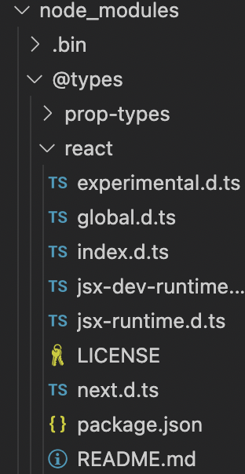
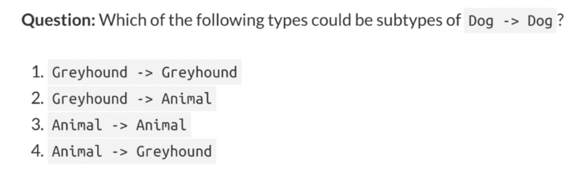
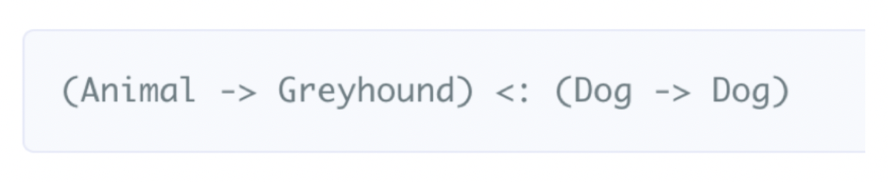
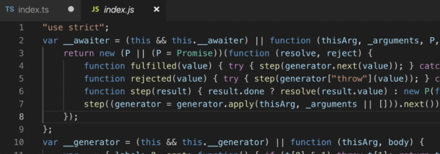

## typeRoots, type

react 라이브러리 설치

```bash
npm i react
npm i --save-dev @types/react
```



<br/>

### @types

- TypeScript 2.0 부터 사용 가능해진 내장 type definition 시스템
- 아무 설정 X
    - node_modules/@types 라는 모든 경로를 찾아서 사용
- `typeRoots` 사용
    - 배열 안에 들어있는 경로들 아래서만 가져옴
- `types` 사용
    - 배열 안의 모듈 혹은 ./node_modules/@types/ 안의 모듈 이름에서 찾아옴
    - [] 빈 배열을 넣는다는건 이 시스템을 이용하지 않겠다는 것
- `typeRoots` 와 `types` 를 같이 사용하지 않음

<br/>

## target과 lib

### target

- `target` 빌드의 결과물을 어떤 버전으로 할 것인지
- 지정 안 하면 es3

### lib

- 기본 type definition 라이브러리를 어떤 것을 사용할 것인지
- `lib` 지정하지 않을 때
    - `target` 이 'es3' 이고, 디폴트로 lib.d.ts 를 사용
    - `target` 이 'es5' 이면, 디폴트로 dom, es5, scripthost 를 사용
    - `target` 이 'es6' 이면, 디폴트로 dom, es6, dom.iterable, scripthost 를 사용
- `lib` 지정하면 그 `lib` 배열로만 라이브러리를 사용
    - 빈 [] => 'no definition found ...'

<br/>

#### compileOptions: target

"target": "es5"일 때

- test.ts

```tsx
const hello = () => {};
```

- test.js

```jsx
"use strict";
var hello = function () { };
```

"target": "es6"으로 변경

- test.js

```jsx
"use strict";
const hello = () => { };
```

#### compileOptions: lib

`target`에 따라 `lib`이 기본적으로 지정되는 값이 있으나 추가적으로 지정하고 싶은 경우 `lib` 작성

- test.js

```tsx
const hello = () => {
  console.log("hello");
};
```

→ console은 lib.dom.d.ts에서 가져와 사용하는 것이 아니므로 `tsconfig.json` 안에서 "lib": []을 주석 처리 하면 오류가 뜨게 됨

→ 주석 해제하면 다시 원상태로 복구, 이는 dom 안의 `lib`에서 기본적으로 console을 내장하고 있다는 뜻

<br/>

## outDir, outFile, rootDir

일반적인 형태로 하나의 파일로 분리시키기는 불가능

`rootDir`에 따라서 결과물이 달라짐

- tsconfig.json

```jsx
"outDir": "./dist",                                   /* Specify an output folder for all emitted files. */
"rootDir": "./src",
```

`rootDir`를 지정하지 않은 경우 ts 파일에서 가장 상단을 컴파일하므로 그 하위로 파일 생성

`src`를 잡고 `rootDir`을 사용하여 `dist`로 컴파일하고 싶은 경우 `dist` 밑으로 `src`가 생성되지 않고 `test.js` 바로 생성

<br/>

## strict

엄격하게 타입을 확인하는 옵션을 활성화함

### --noImplicitAny

명시적이지 않게 `any` 타입을 사용하여 표현식과 선언에 사용하면 에러를 발생

```tsx
function noImplicitAnyTestFunc(arg) {
	console.log(arg);
}
```

- 타입스크립트가 추론 실패한 경우 `any`가 맞으면 `any`로 지정
- 아무것도 쓰지 않은 경우 에러
- 오류 해결 시 `any`라고 지정되어 있지 않은 경우는 `any` 아님
타입 추론이 되었기 때문

### suppressImplicitAnyIndexErrors

`noImplicitAny` 사용할 때 인덱스 객체에 인덱스 `signiture`가 없는 경우 오류가 발생하는 데 이를 예외 처리

```tsx
var obj = {
	bar: 10
};

obj['foo'] = 10;
// Error: Index signiture of object tyep implicitly has an 'any' type
obj['bar'] = 10;
// Okay
obj.baz = 10;
```

- `obj['foo']`로 사용할 때 인덱스 객체라 판단하여 타입에 인덱스 시그니처가 없는 경우 에러 발생
- `suppressImplicitAnyIndexErrors` 사용하면 이런 경우를 예외로 간주하여 에러를 발생시키지 않음

### --noImplicitThis

명시적이지 않게 `any` 타입을 사용하여 `this` 표현식에 사용하면 에러 발생

```tsx
function noImplicitThisTestFunc(name: string, age: number) {
this.name = name;
this.age = age;
return this;
}

console.log(noImplicitThisTestFunc.call({ height: 160 }, 'Mark', 36));
console.log(noImplicitThisTestFunc.apply({ height: 170 }, ['Mark', 36]));
console.log(noImplicitThisTestFunc.bind({ height: 180 })('Mark', 36));
```

- 첫 번째 매개변수 자리에 `this`를 놓고 `this`에 대한 타입을 어떤 것이라도 표현하지 않으면 `noImplicitAny`가 오류를 발생
- JavaScript에서는 매개변수에 `this`를 넣으면 예약 키워드이기 때문에 `SyntaxError` 발생
- `call` / `apply` / `bind`와 같이 this를 대체하여 함수 콜을 하는 용도로도 쓰임
- `this`를 `any`로 명시적으로 지정하는 것은 합리적
구체적인 사용처가 있는 경우 타입을 표현하기도 함

<br/>

```tsx
class noImplicitThisTestClass {
	private _name: string;
	private _age: number;

	constructor(name: string, age: number) {
		this._name = name;
		this._age = age;
	}

	public print(this: noImplicitThisTestClass) {
		console.log(this._name, this._age);
	}
}
```

- Class에서는 `this`를 사용하며 `noImplicitThis`와 관련한 에러가 나지 않음
- Class에서 constructor를 제외한 멤버 함수의 첫 번째 매개변수도 일반 함수와 마찬가지로 `this` 사용할 수 있음

### --strictNullChecks

`strictNullChecks` 모드에서는 `null` 및 `undefined` 값이 모든 유형의 도메인에 속하지 않으며 그 자신을 타입으로 가지거나 `any`일 경우에만 할당이 가능

- 예외: `undefined`에 `void` 할당 가능

```tsx
const a: nubmer = null;
const b: string = undefined;
const c: number | null = null;
const d: any = null;
const e: any = undefined;
const f: void = undefined;
```

`strictNullChecks` 적용하지 않을 경우

- 모든 타입은 `null`, `undefined` 값을 가질 수 있음
- `string`으로 타입 지정해도 `null` 혹은 `undefined` 할당 가능

<br/>

#### strictNullChecks

- 모든 타입은 `null`, `undefined` 값을 가질 수 없으며 가지려면 union type 이용하여 직접 명시
- `any` 타입은 `undefined` 가짐 예외적으로 `void`는 `undefined를` 가짐

- `strictNullChecks`를 적용하지 않고 어떤 값이 `null`이나 `undefined`를 가진다는 것을 암묵적으로 인정하고 계속 사용하다 보면 정확히 어떤 타입이 오는지를 개발자 스스로가 간과 가능
- `null`과 `undefined`를 가질 수 있는 경우 해당 값을 조건부로 제외하고 사용하는 것이 좋음
- 이 옵션 켜고 사용할 경우 사용하려는 함수를 선언할 때부터 매개변수와 리턴 값에 정확한 타입을 지정하려는 노력을 기울여야 함

### --strictFunctionTypes

함수 타입에 대한 `bivariant` 매개변수 검사를 비활성화




- 반환 타입 공변적(convariant), 인자 타입 반공변적(contravariant)
    - 타입스크립트에서 인자 타입은 공변적이면서 반공변적인 게 문제
    - 문제를 해결하는 옵션 strictFunctionTypes
    - 옵션 켤 경우 에러가 안 나던 것을 발생시킴

### --strictPropertyInitialization

정의되지 않은 클래스의 속성이 생성자에서 초기화되었는지 확인

옵션 사용 시 `--strictNullChecks `사용하도록 설정

```tsx
class Person {
	private _name: string;
	private _age: number;
	// Error
	constructor() {}

	public print() {
		console.log(this._name, this._age);
	}
}
```

수정

- constructor에 할당하면 에러 해결

```tsx
class Person {
	private _name: string;
	private _age: number;

	constructor(name: string, age: number) {
		this._name = name;
		this._age = age;
	}

	public print() {
		console.log(this._name, this._age);
	}
}
```

constructor에서 사용하지 않는 경우

- 보통 다른 함수로 이니셜라이즈 하는 경우 (`async` 함수)
- constructor에는 `async` 사용 불가능

```tsx
class Person {
	private _name: string;
	private _age: number;

	public async async initialize(name: string, age: number) {
		this._name = name;
		this._age = age;
	}

	public print() {
		console.log(this._name, this._age);
	}
}
```

### --strictBindCallApply

`bind`, `call`, `apply`에 대해 더 엄격한 검사 수행

- Function의 내장 함수인 `bind` / `call` / `apply`를 사용할 때 엄격하게 체크하도록 하는 옵션
- `bind`는 해당 함수 안에서 사용할 this와 인자를 설정해 주는 역할, `call`과 `apply`는 this와 인자를 설정한 후 실행까지 수행
- `call`과 `apply`는 인자를 설정하는 방식에서 차이점
    - `call`은 함수의 인자를 여러 인자의 나열로 넣어서 사용하며 `apply`는 모든 인자를 배열 하나로 사용

### --alwaysStrict

각 소스 파일에 대해 JavaScript의 `strict mode`로 코드를 분석하고 "엄격하게 사용"을 해제

```tsx
var e1 = 015;
var e2 = { p: 1, p: 2 };
// Error: strict 모드에서는 개체 리터럴에 이름이 같은 여러 개의 속성을 사용할 수 없습니다
var e3;
delete e3;
```

→ syntax 에러가 ts error로 발생



→ 컴파일된 js 파일에 "use strict" 추가됨