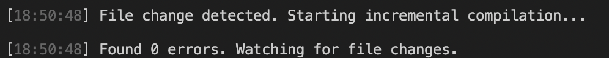
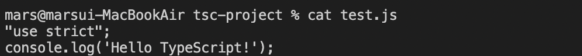
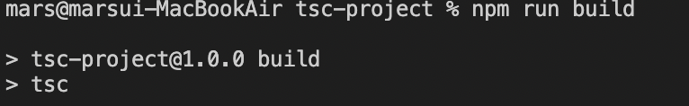
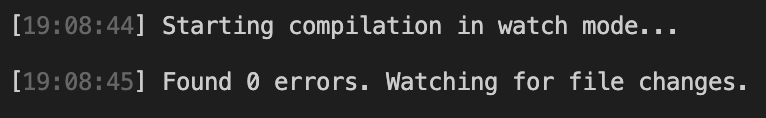

## 설치 및 사용

### 실행 환경

- node.js  
: Chrome's V8 JavaScript Engine을 사용하여 자바스크립트를 해석하고 OS 레벨에서의 API를 제공하는 서버사이드용 자바스크립트 런타임 환경
- browser  
: HTML을 동적으로 만들기 위해 브라우저에서 자바스크립트를 해석하고, DOM을 제어할 수 있도록 하는 자바스크립트 런타임 환경

### node.js 설치

1. [https://nodejs.org](https://nodejs.org)
    - v14.16.0 LTS
    - v15.12.0 Current
2. node.js version manager
    - nvm
        - [https://github.com/creationix/nvm](https://github.com/creationix/nvm)
        - [https://github.com/coreybutler/nvm-windows](https://github.com/coreybutler/nvm-windows)
    - n
        - [https://github.com/tj/n](https://github.com/tj/n)

### browser 설치

- Chrome 사용 권장

### TypeScript 컴파일러 설치

1. npm
    - `npm i typescript -g` 실행
    - node_modules/.bin/tsc 폴더 생성됨
    - tsc source.ts
2. Visual Studio plugin 설치
    - Visual Studio 2017 / 2015 Update 3 이후로는 디폴트로 설치되어 있음
    - 그렇지 않을 경우 설치

---

전역으로 예제 실행

커맨드라인에서 에디터 오픈

```bash
nano test.ts
```

해당 내용 작성 후 저장 및 종료

```jsx
console('hello');
```

컴파일 실행

```bash
tsc test.ts
```

TS 파일 생성 확인

```bash
cat test.ts
```

JS 파일로 컴파일(transpile)

```bash
cat test.js
```

---

프로젝트 생성

```bash
mkdir tsc-project
```

프로젝트 폴더 안으로 이동

```bash
cd tsc-project
```

커맨드라인 에디터로 이동하여 `console.log('helllo!');` 입력

```bash
nano test.ts
```

기본 설정 파일 생성

```bash
tsc --init
# tsconfig.json 파일 생성됨
```

js 파일로 컴파일

```bash
tsc
# test.js 파일 생성됨
# 수정할 때마다 tsc 사용해야 하는 번거로움
```

수정될 때마다 자동 컴파일 되도록 함

```bash
tsc -w
```



터미널 창 하나 더 추가하여 JS 파일도 자동 컴파일되었는지 확인

```bash
cat test.js
```



---

전역으로 생성한 TypeScript 파일 제거하기

```bash
npm uninstall typescript -g
```

위에서 생성한 프로젝트도 제거

```bash
npm -rf tsc-project
```

---

프로젝트 안에서 시작하기

프로젝트 생성

```bash
mkdir tsc-project
```

프로젝트 폴더 안으로 이동

```bash
cd tsc-project
```

프로젝트 정보 가져오기

```bash
npm init -y
# node_modules 폴더와 package.json 파일 생성됨
```

npm 라이브러리 설치

```bash
npm i typescript
# package.json 파일 안에서 typescript 버전 확인 가능
```

tsconfig.json 파일 생성하기

```bash
npx tsc --init
```

에디터 열어 console.log('Hello'); 작성

```bash
nano test.ts
```

컴파일 실행

```bash
npx tsc
# test.js 파일 생성됨
```

package.json에서 해당 내용 수정

```bash
"scripts": {
    "build": "tsc"
  }
# node_modules/.bin/tsc를 줄여 자동으로 실행되도록 함
```

다음과 같이 tsc 실행 가능

```bash
npm run build
```



watch 기능도 다음과 같이 수정하여 사용 가능

```bash
# package.json
"scripts": {
    "build": "tsc",
		# 추가
    "build:watch": "tsc -w"
  }
```

```bash
npm run build:watch
```

