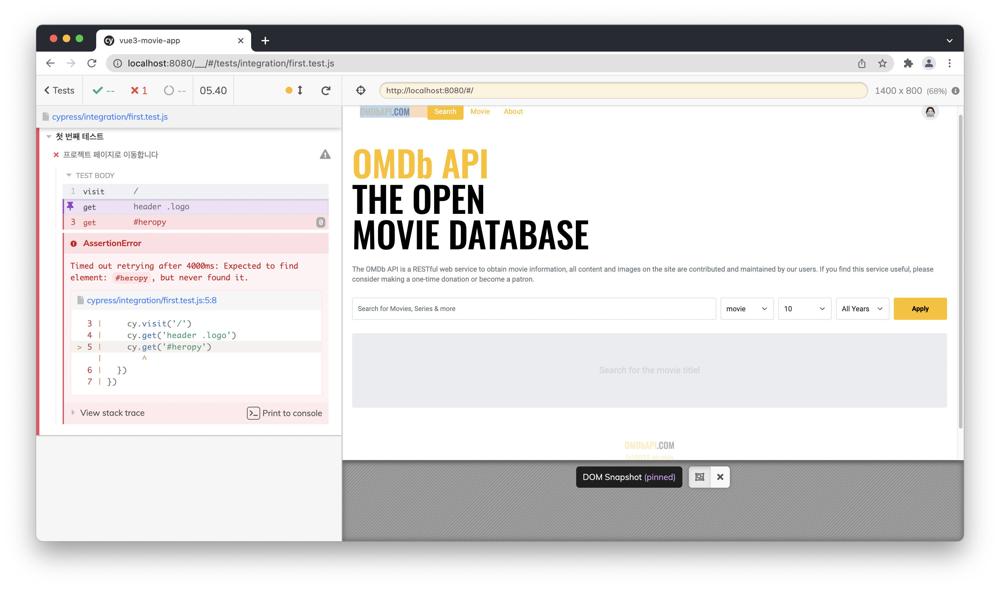

## Cypress 설치 및 환경 구성
Cypress 패키지 설치

```bash
npm i -D cypress eslint-plugin-cypress
```

package.json

- test:e2e 등록

```json
"scripts": {
    "dev:webpack": "webpack-dev-server --mode development",
    "dev": "netlify dev",
    "build": "webpack --mode production",
    "lint": "eslint --fix --ext .js,.vue",
    "test:unit": "jest --watchAll",
    "test:unit:silent": "jest --watchAll --silent",
    "test:e2e": "cypress open"
  },
```

<br/>

### E2E 테스트

- 브라우저에 새로 띄워 입력한 명령어 순서대로 화면에서 직접 테스트하며 사용자가 직접 사이트를 이용하는 것처럼 확인
- 실제 화면이 원하는 시나리오대로 동작하는지 체크

<br/>

.eslintrc.js

- 샘플 테스트에서 cypress 관련 오류가 뜨므로 cypress 관련 옵션 추가

```json
env: {
    browser: true,
    node: true,
    jest: true,
    'cypress/globals': true
  },
  plugins: [
    'cypress'
  ],
```

---

### 테스트
- `it`: 단위 테스트에서의 test와 동일
- `cy`: 단위 테스트에서의 jest와 동일
- get 메소드에서 css 선택자로 `header의` `logo` 클래스를 찾도록 함
    - 찾으면 해당 부분을 파란색으로 표시함
- heropy라는 `id` 값을 찾도록 작성
    - 찾지 못하면 그냥 패스함

```jsx
describe('첫 번째 테스트', () => {
  it('프로젝트 페이지로 이동합니다', () => {
    cy.visit('/')
    cy.get('header .logo')
    cy.get('#heropy')
  })
})
```

cypress.json

- `baseUrl` 설정으로 매번 로컬 주소 입력할 필요 없게 만듦
    - `cy.visit(’/’)`로 설정
- `viewportWidth`, `viewportHeight로` 뷰 포트의 너비 설정

```json
{
  "baseUrl": "http://localhost:8080",
  "viewportWidth": 1400,
  "viewportHeight": 800
}
```

개발 서버 오픈 및 cyrpess 실행

```bash
npm run dev
npm run test:e2e
```

