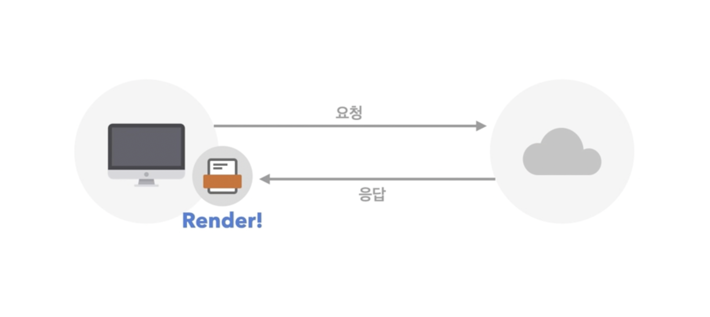
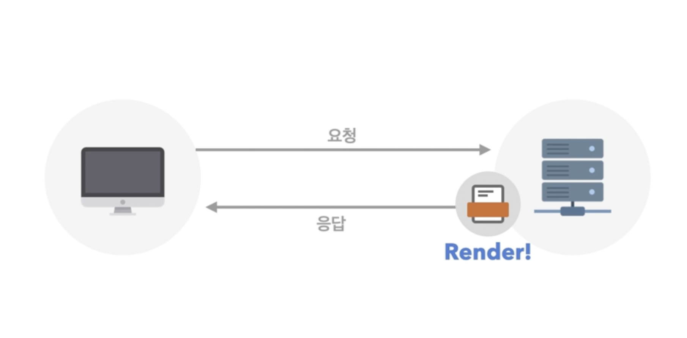
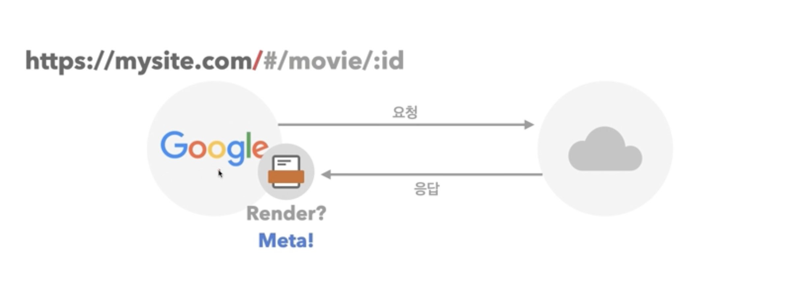
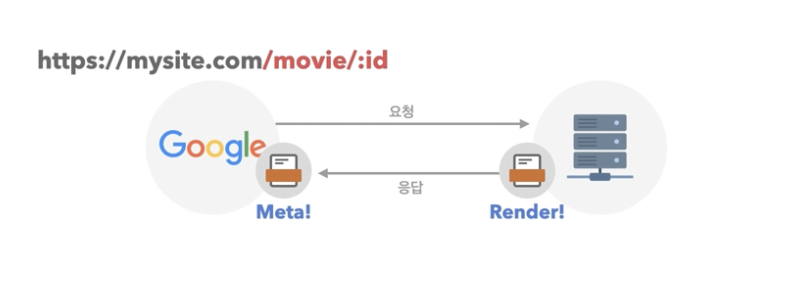

## CSR / SSR
### CSR (Client Side Rendering)

- 사용자가 웹 브라우저를 볼 수 있는 환경을 클라이언트
- 클라이언트 측에서 렌더링이 일어나기 때문에 CSR이라고 부름

사용자가 특정 사이트를 컴퓨터를 보고 싶어 한다고 가정

1. 사용자의 컴퓨터에서 사이트로 접속
2. 서버로 요청 발생
3. 서버에서 특정 데이터를 응답시킴
    - HTML, CSS, JS 등의 데이터일 것
4. 서버로부터 받은 데이터를 렌더링하여 화면에 출력

 

싱글 페이지 애플리케이션 방식 웹의 about 페이지로 접근했다고 가정

- 새로운 페이지로 이동했으니 새로 요청을 보내고 응답을 받을 거라고 생각하지만 아님
- 별도의 통신이 발생하지 않음

이유

- 싱글 페이지 애플리케이션 방식은 단일 페이지로 사이트를 출력해서 관리함
- 처음 발생한 요청과 응답을 통해서만 데이터를 페이지에 렌더링
- 그 다음 페이지부터는 가지고 온 데이터로만 렌더링 진행

### SSR (Server Side Rendering)

: 서버에서 미리 렌더링을 진행하여 전송

1. 사용자가 사이트 확인을 위해 서버로 요청 보냄
2. 서버에서 사용자에게 보낼 데이터를 미리 렌더링하여 전송

구글 검색 엔진이 어떤 웹의 상세 정보 페이지를 가져가려 한다고 가정

1. 구글이 웹 서버로 사이트를 보여 달라고 요청
2. 최초로 웹 서버가 응답 전송
3. 구글이 응답 정보를 렌더링하여 확인

그러나 검색 엔진은 하나의 사이트를 화면에 그려서 정보를 가져가지 않음

- 사이트에 대한 정보를 받아와 렌더링하지 않고 사이트가 가진 메타 정보를 가지고서만 어떠한 정보를 가지고 있는지 확인한 후 종료
- 때문에 검색 엔진에서는 사이트가 어떻게 생겼는지 알 수 없음

렌더링하지 않는 이유

- 전 세계의 수많은 사이트, 페이지들을 하나씩 찾아가며 내용을 확인하게 됨
- 화면을 하나씩 그려 가며 확인한다면 굉장히 비효율적
- 그러므로 페이지 head 부분에 쓰여진 메타 정보만 확인함

SSR 방식으로 렌더링할 경우

1. 구글 검색 엔진은 명시된 주소 서버에 요청을 보냄
2. 서버는 SSR 방식으로, 즉 미리 렌더링하여 사용자에게 보냄
3. 구글 검색 엔진은 충분히 내용이 많이 렌더링된 정보를 받음
4.  이의 메타 정보를 확인하여 실제 검색 가능 구조로 제공