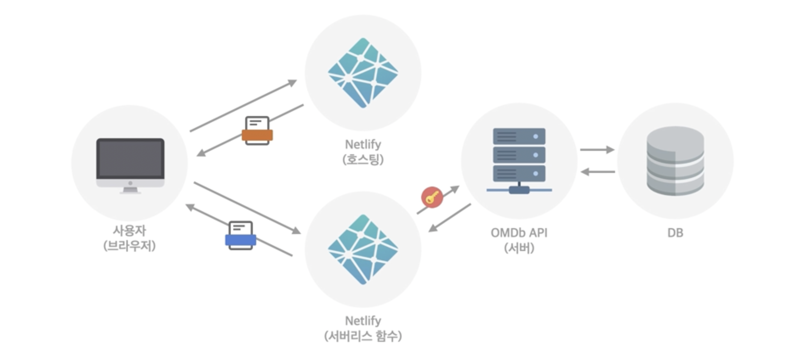
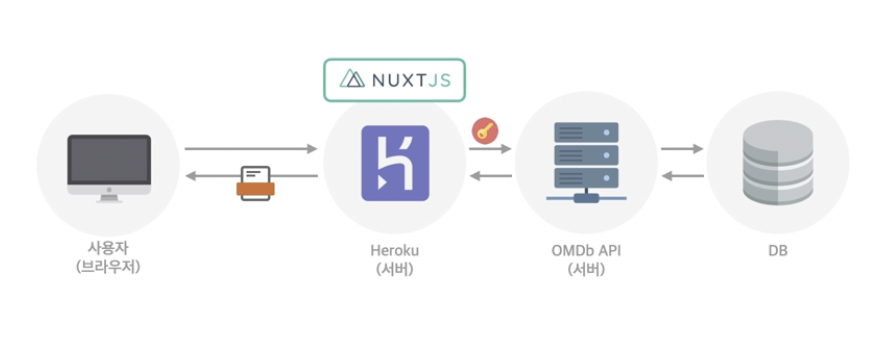

## Nuxt / Heroku



Netlify는 빌드된 결과를 저장하는 호스팅 서버이며, 단점을 보완하기 위해 서버리스 함수 제공함

- SPA를 구현하는 데에는 최적화되어 있음

SPA의 단점 중 하나인 SEO 제공 위해 SSR을 도입해야 하지만 Netlify는 호스팅 서버만 제공하므로 페이지를 렌더링할 수 있는 환경은 제공하지 않음

- 서버리스가 가능하도록 처리해 줄 수는 있으나 꽤 복잡한 기술을 필요로 함
- Nuxt 프레임워크 도입으로 해결 가능



<br/>

### Heroku

- 컴퓨팅 환경이 제공되는 웹 서버
- 특정 페이지를 렌더링하여 사용자에게 보내 줄 수 있음
- 항시 개발 서버를 열어 놓는 것과 유사하게 내부적인 컴퓨팅 환경에서 프로젝트를 하나의 서버로 오픈해 두고 그 결과를 사용자에게 보여 주는 구조
- Nuxt.js라는 SSR를 지원하는 Vue.js의 템플릿을 활용할 수 있음
- 서버리스 함수를 도입하지 않아도 Heroku 자체가 서버이므로 동작할 수 있는 환경만 만들어 주면 됨
- 개념적으로는 SPA를 Netlify로 배포하고 서버리스 함수 도입하여 기능을 보완하는 과정을 거치지 않아도 돼서 쉬워 보이나 내부적으로는 조금 더 복잡한 로직을 필요로 함

<br/>

### Nuxt

- [Docs](https://nuxtjs.org/docs/get-started/installation)

패키지를 별도로 설치하지 않아도 터미널에서 해당 명령을 통해 바로 프로젝트 시작 가능

```bash
npx create-nuxt-app <project-name>
```

`npm run dev`로 개발 서버를 여는 것과는 다르게 `npm start`를 통해 제품용 서버 오픈 사용

- `run` 키워드 없이 사용 가능

```json
{
  "name": "my-app",
  "scripts": {
    "dev": "nuxt",
    "build": "nuxt build",
    "generate": "nuxt generate",
    "start": "nuxt start"
  }
}
```

#### SSR

- [Docs](https://nuxtjs.org/docs/concepts/server-side-rendering)
- SSR 제공 위해 Node.js 환경을 설치해야 함
- Heroku 서버도 Node.js 환경이기 때문에 별도로 설치하지 않아도 Heroku에서 동작시키면 Node.js 환경에서 제품용 서버 오픈됨

#### Meta Tags and SEO

- [Docs](https://nuxtjs.org/docs/features/meta-tags-seo)
- nuxt.config.js 파일에서 head 옵션을 통해 head 태그의 내용 제공하듯 여러 관련 내용을 JS의 객체 데이터 형식으로 작성 가능
- index.html과 같이 별도의 파일이 없고 하나의 구성 옵션으로 내용들을 제공
    - JS 문법으로 작성

```jsx
export default {
  head: {
    title: 'my website title',
    meta: [
      { charset: 'utf-8' },
      { name: 'viewport', content: 'width=device-width, initial-scale=1' },
      {
        hid: 'description',
        name: 'description',
        content: 'my website description'
      }
    ],
    link: [{ rel: 'icon', type: 'image/x-icon', href: '/favicon.ico' }]
  }
}
```

#### Pages

- [Docs](https://nuxtjs.org/docs/directory-structure/pages)
- 기존: 페이지를 구분하기 위해 vue router 설치 후 plugin으로 등록하여 index.js로 관리
- nuxt.js: pages 폴더 내부에 각각의 폴더와 파일을 구분해 놓은 형태로 페이지 관리