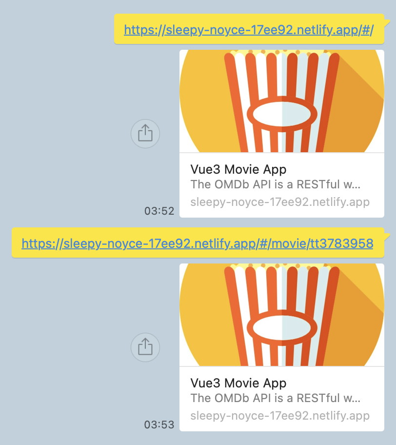

## Open Graph

### The Open Graph protocol

: 웹 페이지의 메타 데이터를 사용해 페이지 콘텐츠 표시를 표준화하기 위한 페이스북에서 만든 인터넷 프로토콜

### [Basic Metadata](https://ogp.me/#metadata)

- head 태그의 title, link. script, style 태그를 제외한 모든 정보는 meta 태그로 명시 가능
- `og`: open graph의 약어

```html
<html prefix="og: https://ogp.me/ns#">
<head>
<title>The Rock (1996)</title>
<meta property="og:title" content="The Rock" />
<meta property="og:type" content="video.movie" />
<meta property="og:url" content="https://www.imdb.com/title/tt0117500/" />
<meta property="og:image" content="https://ia.media-imdb.com/images/rock.jpg" />
...
</head>
...
</html>
```

<br/>

index.html

- 각 og 속성에 맞는 내용 작성
- 그러나 SPA는 다른 페이지 접속 후 링크 공유 시 해당 페이지에 해당하는 관련 이미지가 아닌 og에서 지정한 이미지로만 표시되는 단점

```html
<meta property="og:type" content="website" />
<meta property="og:site_name" content="Vue3 Movie App" />
<meta property="og:title" content="Vue3 Movie App" />
<meta property="og:description" content="The OMDb API is a RESTful web service to obtain movie information, all content and images on the site are contributed and maintained by our users. If you find this service useful, please consider making a one-time donation or become a patron.">
<meta property="og:image" content="https://cdn-icons-png.flaticon.com/512/230/230401.png" />
<meta property="og:url" content="https://sleepy-noyce-17ee92.netlify.app/"/>
```

