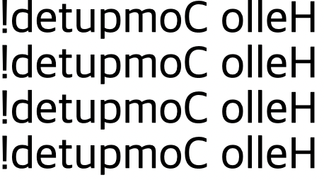

## Computed 캐싱

App.vue

- `msg` 데이터가 출력되는 부분에 문자 데이터 ?? 추가

```jsx
<template>
  <h1>{{ msg + '??' }}</h1>
</template>

<script>
export default {
  data() {
    return {
      msg: 'Hello Computed!'
    }
  }
}
</script>
```


<br/>

template 수정

- `split`으로 문자 하나씩 쪼개서 배열로 만들기 → `reverse`로  뒤집기 → `join`으로 뒤집어진 단어들 합치기

```jsx
<template>
  <h1>{{ msg.split('').reverse().join('') }}</h1>
</template>
```


<br/>

- h1 태그의 이중괄호 안에 작성한 내용을 `reverseMessage`에 작성
    - 위와 동일한 화면 반환
- `computed` 옵션 추가하여 `reversedMessage` 작성
    - `reverseMessage`의 내용 똑같이 가져와 로직 작성
- `computed`에서 계산된 내용을 가져오는 것이기 때문에 `reversedMessage()`로 가져올 필요 없이 `reversedMessage`로 가져옴
- `methods`는 삭제해도 무관

```jsx
<template>
  <h1>{{ reversedMessage }}</h1>
  <h1>{{ reversedMessage }}</h1>
  <h1>{{ reversedMessage }}</h1>
  <h1>{{ reversedMessage }}</h1>
</template>

<script>
export default {
  data() {
    return {
      msg: 'Hello Computed!'
    }
  },
  computed: {
    reversedMessage() {
      return this.msg.split('').reverse().join('')
    }
  },
  methods: {
    reverseMessage() {
      return this.msg.split('').reverse().join('')
    }
  }
}
</script>
```



<br/>

요약

- `computed`라는 옵션에서 만들어 놓은 계산된 데이터는 캐싱 기능이 있음
- 한 번 만들어 놓은 값이 있으면 반복적으로 데이터처럼 출력할 때 다시 연산하지 않음
- 캐싱된 값으로 그대로 화면에 출력함
- 특정한 데이터를 정의해 놓고 원본 데이터를 손상시키지 않게 계산된 데이터 형식으로 내용을 추가로 만들어서 사용하더라도 캐싱 기능 때문에 간단 및 복잡한 로직을 부담 없이 사용할 수 있음