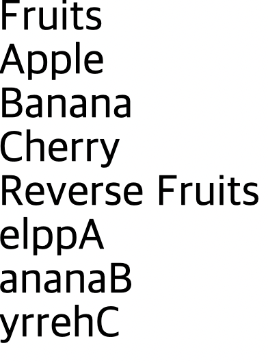

## Computed

App.vue

- import문으로 Fruits.vue 파일과 연결
- components 옵션을 객체 데이터로 선언하여 Fruits 컴포넌트를 연결
- `Fruits`를 `template`에 빈 태그로 가지고 옴

```vue
<template>
  <Fruits />
</template>

<script>
import Fruits from '~/components/Fruits'
export default {
  components: {
    Fruits
  }
}
</script>
```

Fruits.vue

```vue
<template>
  <section v-if="fruits.length > 0">
    <h1>Fruits</h1>
    <ul>
      <li
        v-for="fruit in fruits"
        :key="fruit">
        {{ fruit }}
      </li>
    </ul>
  </section>
</template>

<script>
export default {
  data() {
    return {
      fruits: [
        'Apple', 'Banana', 'Cherry'
      ]
    }
  }
}
</script>
```

<br/>

- `data` 옵션 밑에 `computed` 옵션 추가 후 `hasFruit` 메소드 작성
    - `this`로 참조하는 `fruits`의 길이가 0 이상일 경우 `boolean` 형태로 반환

```vue
computed: {
    hasFruit() {
      return this.fruits.length > 0
    }
}
```

<br/>

- `template`의 `section` 태그 안 `v-if`문 수정
    - `fruits.length > 0`을 `hasFruit`로 수정하여 `hasFruit`에서 반환된 `boolean` 값 이용

```vue
<section v-if="hasFruit">
```

<br/>

`fruit`의 아이템 내용 제거 후 실행

- 화면의 내용 모두 사라짐

```vue
data() {
    return {
      fruits: [
        
      ]
    }
  },
```

<br/>

추가 실습

`hasFruit` 아래에 `reverseFruits` 추가

- 기존의 `fruits` 데이터를 `this`로 접근하여 가지고 옴
- `map` 메소드 통해 아이템을 반복하여 새로운 배열 반환
    - 아이템의 이름 `fruit`로 정의
    - `split`으로 과일의 이름을 하나의 단어로 모두 쪼개 배열 데이터로 만듦
    - `reverse`로 단어를 뒤집고 `join`으로 뒤집은 단어를 합침

```vue
reverseFruits() {
      return this.fruits.map(fruit => {
        // 'Apple' => ['A', 'p', 'p', 'l', 'e']
        // => ['e', 'l', 'p', 'p', 'A'] => elppA
        return fruit.split('').reverse().join('')
      })
    }
```

<br/>

`section` 태그 안에 `ul` 태그 작성

- `li` 안에 `v-for` 반복문 작성
    - `fruit`라는 이름으로 아이템 반복
    - `reverseFruit`라는 계산된 데이터 반복

```vue
<template>
  <section v-if="hasFruit">
    <h1>Fruits</h1>
    <ul>
      <li
        v-for="fruit in fruits"
        :key="fruit">
        {{ fruit }}
      </li>
    </ul>
  </section>
  <h1>Reverse Fruits</h1>
  <ul>
    <li
      v-for="fruit in reverseFruits"
      :key="fruit">
      {{ fruit }}
    </li>
  </ul>
</template>
```



요약

- `computed`는 데이터 옵션에 정의해 놓은 특정 데이터를 추가적으로 연산하여 정의한 후 정의된 값을 반환하여 사용하는 새로운 데이터
- 계산된 데이터라고 함