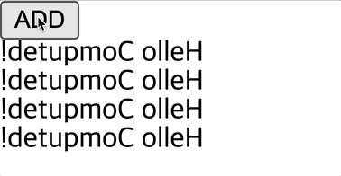

## Getter, Setter

App.vue

- `button`을 클릭할 때 add가 실행되어 누를 때마다 !?가 추가되게 함
- 실행 시 동작하지 않음
    - 계산된 데이터(`reversedMessage`)는 읽기 전용(Readonly)
    - 할당 연산자를 통해 어떤 값을 할당하더라도 반응적으로 동작할 수 있는 구조가 아님
    - 로직을 통해 값을 얻어내는 용도로만 사용
    - `Getter`라고 부름

```vue
<template>
  <button @click="add">
    ADD
  </button>
  <h1>{{ reversedMessage }}</h1>
  <h1>{{ reversedMessage }}</h1>
  <h1>{{ reversedMessage }}</h1>
  <h1>{{ reversedMessage }}</h1>
</template>

<script>
export default {
  data() {
    return {
      msg: 'Hello Computed!'
    }
  },
  computed: {
		// Getter
    reversedMessage() {
      return this.msg.split('').reverse().join('')
    }
  },
  methods: {
    add() {
      this.reversedMessage += '!?'
    }
  }
}
</script>
```

<br/>

해결 방법

- `reversedMessage`를 속성으로 작성
    - `get`과 `set`이라는 메소드를 작성
    - `get`: `reversedMessage`라는 계산된 데이터가 값을 얻어내는 로직 작성
    - `set`: `reversedMessage`에 어떤 값을 할당할 때 실행되는 로직 작성

<br/>

동작

- `add` 메소드가 실행되어 !?가 `reversedMessage`에 추가되어 다시 할당되는 동작이 실행될 경우 `set` 메소드가 실행
- !?가 추가된 새로운 값이 `value`로 사용되고, 원본 데이터가 들어 있는 `msg`에 할당되어 데이터가 변경됨
- 이 변경된 데이터가 뒤집어진 후 getter로 반환 후 반복적으로 출력되는 것
- `set` 메소드에서 console.log(value)로 콘솔창에 미리 출력문 확인 가능

```vue
<script>
export default {
  data() {
    return {
      // Getter, Setter
      msg: 'Hello Computed!'
    }
  },
  computed: {
    // Getter
    // reversedMessage() {
    //   return this.msg.split('').reverse().join('')
    // }

    // Getter, Setter
    reversedMessage: {
      get() {
        return this.msg.split('').reverse().join('')
      },
      set(value) {
        this.msg = value
      }
    }
  },
  methods: {
    add() {
      this.reversedMessage += '!?'
    }
  }
}
</script>
```

