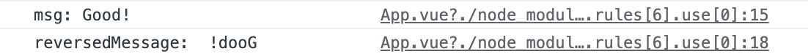

## Watch

App.vue

- `changeMessage`: Good!를 `msg`에 할당
- `wacth`: `msg` 데이터와 `reversedMessage`는 감시되는 상황
    - 변경 사항이 일어난 경우 감시되는 내용에 해당하는 로직 실행
    - console.log('msg:', this.msg) 실행됨

<br/>

동작

- `changeMessage`를 통해 `msg`라는 데이터만 수정하더라도 계산된 데이터의 로직에 의해 원본의 데이터가 바뀌게 되면 계산된 데이터의 결과도 바뀜
- `watch`를 통해 변경 감지된 경우 내부에 있는 로직 실행

```vue
<template>
  <h1 @click="changeMessage">
    {{ msg }}
  </h1>
  <h1>{{ reversedMessage }}</h1>
</template>

<script>
export default {
  data() {
    return {
      msg: 'Hello?'
    }
  },
  computed: {
    reversedMessage() {
      return this.msg.split('').reverse().join('')
    }
  },
  watch: {
    msg() {
      console.log('msg:', this.msg)
    },
    reversedMessage() {
      console.log('reversedMessage: ', this.reversedMessage)
    }
  },
  methods: {
    changeMessage() {
      this.msg = 'Good!'
    }
  }
}
</script>
```



<br/>

메소드에 매개변수로 변경된 값 사용 가능

- `this.msg`와 `this.reversedMessage`를 `newValue`로 사용 가능
- `newValue`: `msg`가 변경되었을 때 그 변경된 값

```vue
watch: {
    msg(newValue) {
      console.log('msg:', newValue)
    },
    reversedMessage(newValue) {
      console.log('reversedMessage: ', newValue)
    }
  },
```


<br/>

요약

- 감시하고 싶은 데이터를 `watch`의 메소드로 만들어 변경됐을 때 어떤 내용을 실행할지를 로직으로 명시