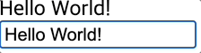

## v-model 수식어
### @change

- `input` 요소에서 데이터를 입력하더라도 바로 반영되지 않고, 블럭 해제나 `enter` 키 입력 등 `input` 요소가 포커싱되지 않는 상황 발생 시 `msg`가 갱신됨

```vue
<template>
  <h1>{{ msg }}</h1>
  <input
    type="text"
    :value="msg"
    @change="msg = $event.target.value" />
</template>

<script>
export default {
  data() {
    return {
      msg: 'Hello World!'
    }
  }
}
</script>
```



<br/>

- 양방향 데이터 바인딩 단축 버전
    - `lazy`: 게으르다는 뜻, 고로 데이터가 다 입력된 후에 연결된 데이터를 갱신

```vue
<template>
  <h1>{{ msg }}</h1>
  <input
    type="text"
    v-model.lazy="msg" />
</template>

<script>
export default {
  data() {
    return {
      msg: 'Hello World!'
    }
  }
}
</script>
```

<br/>

- 심화
    - 입력 데이터의 타입이 숫자로 유지되어야 한다면 `v-model` 뒤에 `number` 수식어 추가
    - `watch` 통해 데이터를 입력하는 즉시 바로 반응성을 띄도록 함

```vue
<template>
  <h1>{{ msg }}</h1>
  <input
    type="text"
    v-model.number="msg" />
</template>

<script>
export default {
  data() {
    return {
      msg: 123
    }
  },
  watch: {
    msg() {
      console.log(typeof this.msg)
    }
  }
}
</script>
```

<br/>

- `trim` 수식어 사용
    - 문자열의 맨 앞, 맨 뒤 공백을 제거해 주는 역할을 함
    - 콘솔에 내용이 출력되지 않는 이유
        - 항상 공백이 제거된 상태로 제거되기 때문에 기존의 Hello World와 변경된 Hello World의 값이 똑같기 때문에 변경된 값이 없는 것으로 판단하기 때문

```vue
<template>
  <h1>{{ msg }}</h1>
  <input
    type="text"
    v-model.trim="msg" />
</template>

<script>
export default {
  data() {
    return {
      msg: 'Hello World!'
    }
  },
  watch: {
    msg() {
      console.log(this.msg)
    }
  }
}
</script>
```