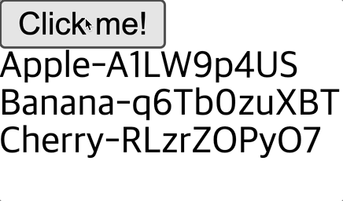

## 리스트 렌더링

App.vue

- 배열 데이터를 `v-for`로 반복 처리 할 때 반복되는 숫자 데이터가 필요하다면 반복 아이템을 소괄호로 묶어 새로운 변수로 만들 수 있음
- 배열 데이터를 각각의 아이템을 지칭하는 첫 번째 매개변수, 반복되는 수치를 가진 두 번째 매개변수로 구분하여 `v-for` 안에서 활용 가능

```jsx
<template>
  <ul>
    <li
      v-for="(f, i) in fruits"
      :key="f">
      {{ f }}-{{ i }}
    </li>
  </ul>
</template>

<script>
export default {
  data() {
    return {
      fruits: ['Apple', 'Banana', 'Cherry']
    }
  }
}
</script>
```

<br/>

복잡한 배열 데이터 다루기

- `computed`라는 옵션과 하위에 `newFruits` 옵션 추가
    - `this`로 `fruit`를 참조하여 `map` 메소드를 이용해 새로운 배열 데이터로 내보냄
    - `id`에는 `index`, `name`에는 `fruit`로 객체 데이터 반환되도록 함
- `key`에는 고유한 값이 들어가야 하므로 `fruit`의 `id` 값을 지정

```jsx
<template>
  <ul>
    <li
      v-for="fruit in newFruits"
      :key="fruit.id">
      {{ fruit.name }}
    </li>
  </ul>
</template>

<script>
export default {
  data() {
    return {
      fruits: ['Apple', 'Banana', 'Cherry']
    }
  },
  computed: {
    newFruits() {
      return this.fruits.map((fruit, index) => {
        return {
          id: index,
          name: fruit
        }
      })
    }
  }
}
</script>
```


<br/>

각각의 id를 고유하게 만들어 주는 패키지 설치

```bash
npm i -D shortid
```

패키지 가져오기

- `id: index`를 `shortid.generate()`로 변경
    - `shortid`를 생성해 주는 메소드 실행 시 고유한 값의 문자 데이터 반환
    - 문자 데이터가 `id`의 형태로 `newFruits`라는 새로운 배열 데이터로 들어가게 됨
- 화살표 함수에서 매개변수가 하나일 때 소괄호 생략 가능하므로 삭제
- 화살표 함수 내부에서 추가적인 로직 없이 하나의 객체 데이터를 반환할 때 `return` 키워드 생략 가능하므로 삭제 후 작성

결과

- 과일 이름-고유값 형태로 나타남

```jsx
<template>
  <ul>
    <li
      v-for="fruit in newFruits"
      :key="fruit.id">
      {{ fruit.name }}-{{ fruit.id }}
    </li>
  </ul>
</template>

<script>
import shortid from 'shortid'

export default {
  data() {
    return {
      fruits: ['Apple', 'Banana', 'Cherry']
    }
  },
  computed: {
    newFruits() {
      return this.fruits.map(fruit => ({
          id: shortid.generate(),
          name: fruit
        }))
    }
  }
}
</script>
```


<br/>

`newFruits라는` 배열 데이터의 아이템이 객체 데이터일 때

- 객체 구조 분해의 문법으로 활용 가능
- `id`와 `name을` 직접적으로 작성할 수 있음

결과

- `id`의 값이 새로운 고유값으로 변경

```jsx
<template>
  <ul>
    <li
      v-for="{ id, name } in newFruits"
      :key="id">
      {{ name }}-{{ id }}
    </li>
  </ul>
</template>
```


<br/>

코드 추가

- `button` 태그 추가하여 클릭 시 `handler`가 작동하도록 작성
- `handler` 옵션 추가하여 작동될 때 Orange라는 새로운 데이터가 push 되도록 함

결과

- 버튼을 클릭할 때마다 Orange가 새로운 고유한 값과 함꼐 추가됨
- `push` 메소드를 이용해 아이템을 추가하게 되면 실제 배열 아이템을 변경하게 되며, 변경된 내용이 바로 화면에 반영됨
    - 데이터를 갱신하면 화면이 바뀜 → **반응성**

```jsx
<template>
  <button @click="handler">
    Click me!
  </button>
  <ul>
    <li
      v-for="{ id, name } in newFruits"
      :key="id">
      {{ name }}-{{ id }}
    </li>
  </ul>
</template>

<script>
import shortid from 'shortid'

export default {
  data() {
    return {
      fruits: ['Apple', 'Banana', 'Cherry']
    }
  },
  computed: {
    newFruits() {
      return this.fruits.map(fruit => ({
          id: shortid.generate(),
          name: fruit
        }))
    }
  },
  methods: {
    handler() {
      this.fruits.push('Orange')
    }
  }
}
</script>
```



<br/>

### [배열 변경 감지](https://v3.ko.vuejs.org/guide/list.html#%E1%84%87%E1%85%A7%E1%86%AB%E1%84%8B%E1%85%B5-%E1%84%86%E1%85%A6%E1%84%89%E1%85%A9%E1%84%83%E1%85%B3)

#### 변이 메소드

: 감시 중인 배열의 변이 메소드를 래핑하여 뷰 갱신을 트리거함

- `push()` : 배열 데이터의 가장 마지막에 아이템을 밀어넣음
- `pop()` : 배열 데이터의 마지막 아이템을 반환
- `shift()` : 배열 데이터의 가장 앞에 있는 데이터를 반환
- `unshift()` : 배열 데이터의 가장 앞에 데이터를 밀어넣음
- `splice()` : 인덱스를 이용해 데이터를 삽입, 삭제
- `sort()` : 배열을 정렬
- `reverse()` : 배열을 뒤집음

<br/>

#### 배열 교체

- `filter()`, `concat()`, `slice()` 는 원래 배열을 변경하지는 않으나 항상 새 배열을 반환
    - 비-변이 메소드
- 비-변이 메소드는 이전 배열을 새 배열로 바꾸어 반응성을 가지고 화면 갱신 가능
- 기존의 특정 배열 데이터를 새로운 배열 데이터로 할당하더라도 Vue.js에서 최적화하여 화면에 출력하므로 부담 없이 사용 가능

예시

- example1 객체 데이터에 items라는 배열 데이터가 들어 있는데, filter를 통해 새로운 배열 데이터 반환함
- filter는 비변이 메소드이기 때문에 items의 원본이 수정되지 않음
- filter의 결과가 items에 할당되므로 배열을 새로운 배열로 교체하여 사용하게 됨

```jsx
example1.items = example1.items.filter(item => item.message.match(/Foo/))
```