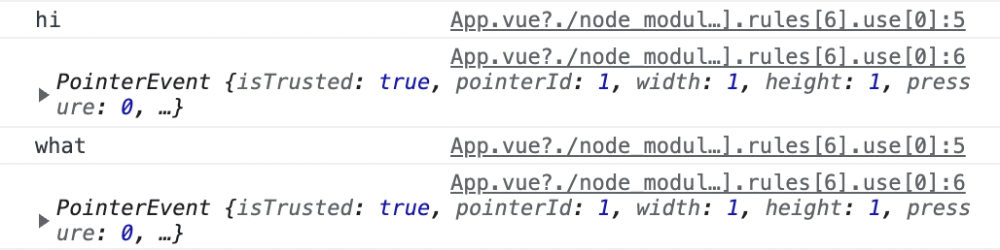

## 이벤트 핸들링

[이벤트 청취](https://v3.ko.vuejs.org/guide/events.html#%E1%84%8B%E1%85%B5%E1%84%87%E1%85%A6%E1%86%AB%E1%84%90%E1%85%B3-%E1%84%8E%E1%85%A5%E1%86%BC%E1%84%8E%E1%85%B1)

- `@click=""은 v-on: click=""`의 약어

[메소드 이벤트 핸들러](https://v3.ko.vuejs.org/guide/events.html#%E1%84%86%E1%85%A6%E1%84%89%E1%85%A9%E1%84%83%E1%85%B3-%E1%84%8B%E1%85%B5%E1%84%87%E1%85%A6%E1%86%AB%E1%84%90%E1%85%B3-%E1%84%92%E1%85%A2%E1%86%AB%E1%84%83%E1%85%B3%E1%86%AF%E1%84%85%E1%85%A5)

- JS를 `v-on` 속성값으로 보관하는 것은 간단하지 않음
- 복잡하다고 표현하는 코드 예시

```html
<div id="basic-event">
  <button @click="counter += 1">Add 1</button>
  <p>The button above has been clicked {{ counter }} times.</p>
</div>
```

- 간단히 표현
    - vue.js의 `scripts`에 `methods`를 추가하여 복잡한 부분 명시
    - `template` 안에서 이벤트 핸들러 형식으로 사용

```html
<div id="event-with-method">
  <!-- `greet`는 메소드 이름으로 아래에 정의되어 있습니다 -->
  <button @click="greet">Greet</button>
</div>
```

```vue
Vue.createApp({
  data() {
    return {
      name: 'Vue.js'
    }
  },
  methods: {
    greet(event) {
      // 메소드 안에서 사용하는 `this` 는 Vue 인스턴스를 가리킵니다.
      alert('Hello ' + this.name + '!')
      // `event` 는 네이티브 DOM 이벤트입니다
      if (event) {
        alert(event.target.tagName)
      }
    }
  }
}).mount('#event-with-method')
```

<br/>

실습

- 버튼을 누르면 `handler`가 실행되도록 작성
- `handler` 안에서는 `event`라는 매개변수를 출력하도록 설정
    - 개발자 도구 확인 시 콘솔에 `PointerEvent`라고 표시됨
- `event.target` 추가 후 콘솔 확인
    - Click me!라는 내용을 포함하고 있는 요소가 직접 출력됨
- `event.target.textContent` 추가 후 콘솔 화긴
    - Click me! 텍스트 출력

```vue
<template>
  <button @click="handler">
    Click me!
  </button>
</template>

<script>
export default {
  methods: {
    handler(event) {
      console.log(event)
      console.log(event.target)
      console.log(event.target.textContent)
    }
  }
}
</script>
```

<br/>

실습 2

- `button`을 두 개 만든 후 각각의 `handler` 안에 다른 문구 작성
    - `handler`처럼 소괄호를 작성하지 않았던 것은 인수가 없을 때 생략 가능한 Vue.js의 문법
    - 문자 데이터와 같은 내용을 인수로 사용해야 할 경우 소괄호 작성

결과

- Click 1 버튼을 누르면 hi 문구가, Click 2 버튼을 누르면 what 문구가 콘솔에 출력
- `$event`로 인해 PointerEvent 객체가 함께 출력

```vue
<template>
  <button @click="handler('hi', $event)">
    Click 1
  </button>
  <button @click="handler('what', $event)">
    Click 2
  </button>
</template>

<script>
export default {
  methods: {
    handler(msg, event) {
      console.log(msg)
      console.log(event)
    }
  }
}
</script>
```



<br/>

실습 3

- 하나의 버튼을 눌렀을 때 여러 개의 함수를 동시에 실행시킬 수 있도록 작성
    - `handlerA()`, `handlerB()` 인수가 없음에도 소괄호 생략 불가능
    - 하나의 요소에 이벤트가 발생 시 실행할 메소드가 여러 개일 경우 쉼표로 구분하되 호출하겠다는 의미의 소괄호를 작성해 주어야 정상적으로 작동됨

```vue
<template>
  <button @click="handlerA(), handlerB()">
    Click me!
  </button>
</template>

<script>
export default {
  methods: {
    handlerA() {
      console.log('A')
    },
    handlerB() {
      console.log('B')
    }
  }
}
</script>
```