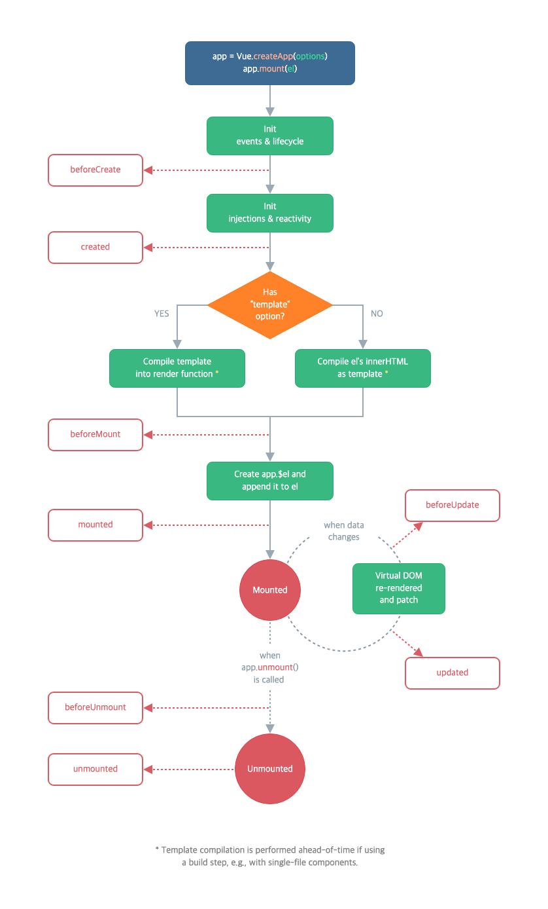
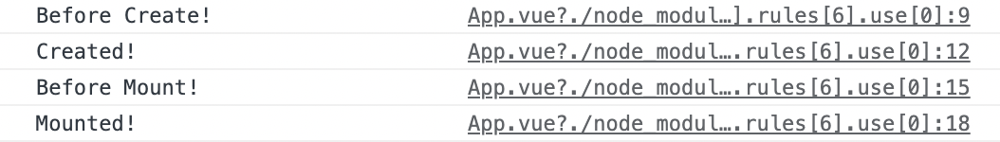
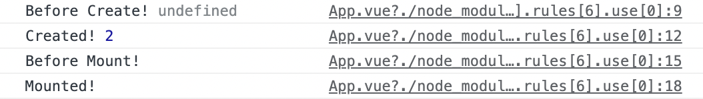
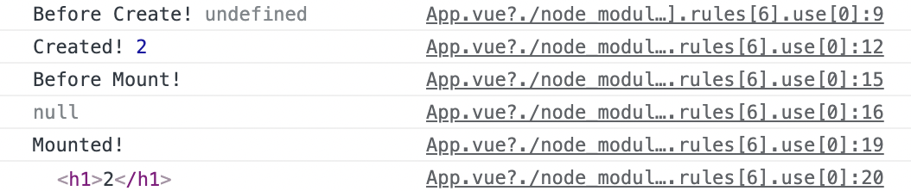

## 인스턴스와 라이프사이클

[Vue.js 3 버전의 애플리케이션 & 컴포넌트 인스턴스 문서](https://v3.ko.vuejs.org/guide/instance.html#%E1%84%8B%E1%85%A5%E1%84%91%E1%85%B3%E1%86%AF%E1%84%85%E1%85%B5%E1%84%8F%E1%85%A6%E1%84%8B%E1%85%B5%E1%84%89%E1%85%A7%E1%86%AB-%E1%84%8B%E1%85%B5%E1%86%AB%E1%84%89%E1%85%B3%E1%84%90%E1%85%A5%E1%86%AB%E1%84%89%E1%85%B3-%E1%84%89%E1%85%A2%E1%86%BC%E1%84%89%E1%85%A5%E1%86%BC%E1%84%92%E1%85%A1%E1%84%80%E1%85%B5)

- `createApp` 함수를 사용하여 새로운 애플리케이션 인스턴스를 생성하여 시작

```jsx
const app = Vue.createApp({ /* options */ })
```

<br/>

### 최상위(Root) 컴포넌트

- `App.vue`라는 파일을 생성 후 연결한 것과 동일
- 하나의 프로젝트를 시작할 때 렌더링이 되는 시작점

```jsx
const RootComponent = { /* options */ }
const app = Vue.createApp(RootComponent)
const vm = app.mount('#app')
```

<br/>

### 컴포넌트 인스턴스 속성들

- `mount`를 통해 html과 연결 후 `vm`의 결과를 `count`라는 데이터를 객체 데이터의 속성 조회 방법으로 접근 가능

```jsx
const app = Vue.createApp({
  data() {
    return { count: 4 }
  }
})

const vm = app.mount('#app')

console.log(vm.count) // => 4
```

### 라이프사이클



라이프 사이클 예제

- `beforeCreated`: 컴포넌트가 생성되기 직전에 실행되는 함수로 활용도 떨어짐
- `created`: 생성된 직후헤 실행되므로 실제 데이터에 접근하기 위해 많이 사용
- `beforeMount`: html에 연결되기 직전에 실행되어 html 구조 조회 불가능하므로 활용도 떨어짐
- `mounted`: html에 연결된 직후헤 실행되므로 html 구조를 읽기 위해 많이 사용

```jsx
<template>
  <h1>{{ count }}</h1>
</template>

<script>
export default {
  data() {
    return {
      count: 2
    }
  },
  beforeCreate() {
    console.log('Before Create!')
  },
  created() {
    console.log('Created!')
  },
  beforeMount() {
    console.log('Before Mount!')
  },
  mounted() {
    console.log('Mounted!')
  }
}
</script>
```



<br/>

count 실제 데이터 조회

- Created! 뒤에는 `2` 출력
- Before Create! 뒤에는 `undefined` 출력
    - `beforeCreate` 라이프 사이클은 컴포넌트 생성 직전에 실행되므로 데이터가 정의되기 전임

```jsx
<template>
  <h1>{{ count }}</h1>
</template>

<script>
export default {
  data() {
    return {
      count: 2
    }
  },
  beforeCreate() {
    console.log('Before Create!', this.count)
  },
  created() {
    console.log('Created!', this.count)
  },
  beforeMount() {
    console.log('Before Mount!')
  },
  mounted() {
    console.log('Mounted!')
  }
}
</script>
```



<br/>

mounted와 beforeMount의 라이프 사이클에 `document.querySelector` 이용하여 `h1` 태그 선택자 찾기

- `beforeMount` 라이프 사이클은 `null` 출력
    - 연결되기 전이므로 html의 구조 조회 불가능
    - 같은 개념으로 `created`도 컴포넌트 생성 직후에 실행되는 것이므로 html 연결 전 상태, `document.querySelector` 이용하여 `h1` 출력하고자 할 경우 `null` 반환
- Mounted 밑에 h1 태그 사이에 2 출력 확인 가능
    - 현재 컴포넌트가 html에 연결되어 있으므로 html 구조 조회하여 출력 가능

```jsx
<template>
  <h1>{{ count }}</h1>
</template>

<script>
export default {
  data() {
    return {
      count: 2
    }
  },
  beforeCreate() {
    console.log('Before Create!', this.count)
  },
  created() {
    console.log('Created!', this.count)
  },
  beforeMount() {
    console.log('Before Mount!')
    console.log(document.querySelector('h1'))

  },
  mounted() {
    console.log('Mounted!')
    console.log(document.querySelector('h1'))
  }
}
</script>
```

