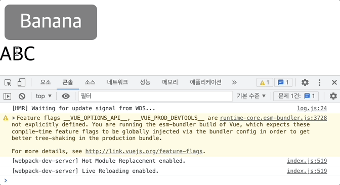
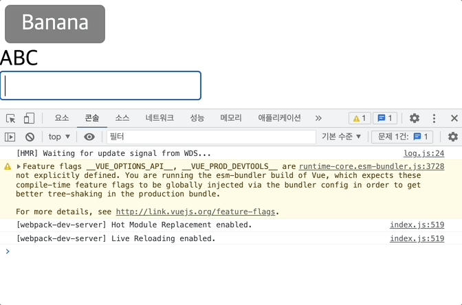

## 컴포넌트 - Emit

App.vue

- `MyBtn` 컴포넌트 클릭 시 `log` 함수가 실행될 수 있는 구조

```jsx
<template>
  <MyBtn @click="log">
    Banana
  </MyBtn>
</template>

<script>
import MyBtn from '~/components/MyBtn'

export default {
  components: {
    MyBtn
  },
  methods: {
    log() {
      console.log('Click!!')
    }
  }
}
</script>
```

MyBtn.vue

```jsx
<template>
  <div class="btn">
    <slot></slot>
  </div>
</template>

<script>
export default {

}
</script>

<style scoped>
  .btn {
    display: inline-block;
    margin: 4px;
    padding: 6px 12px;
    border-radius: 4px;
    background-color: gray;
    color: white;
    cursor: pointer;
  }
</style>
```

<br/>

### 이벤트 직접적으로 컴포넌트에 연결하기

MyBtn.vue

- `script` 내부에서 `emits`를 배열 데이터로 생성하여 `click`이라는 이벤트를 컴포넌트 내부에서 사용할 것이라고 정의
- `h1`을 클릭하게 되면 `emit`이라는 메소드를 실행하게 되며, click이라는 내용 출력
- ABC를 클릭하면 App.vue의 `log`가 실행되어 Click!!이 출력됨

동작

- 특정 이벤트를 상속받아 `scripts`의 `emits` 옵션에 연결
- `template`에서 `emit` 메소드를 통해 내용 작성 후 실행
- `h1` 클릭 시 `emit` 통해 부모 요소에 연결되어 있는 `click` 이벤트 실행하게 됨

```jsx
<template>
  <div class="btn">
    <slot></slot>
  </div>
  <h1 @click="$emit('click')">
    ABC
  </h1>
</template>

<script>
export default {
  emits: [
    'click'
  ]
}
</script>
```



<br/>

`click` 이벤트는 `MyBtn`이라는 컴포넌트의 `emit`으로 넘어가 사용되기 때문에 `click`이라는 이름을 부여하지 않고도 사용 가능

- 컴포넌트에 연결하는 이벤트는 실제로 쓸 수 있는 이벤트의 이름이 아니어도 상관없음
- 원하는 이벤트 이름으로 바꾼 다음 해당하는 컴포넌트 내부의 `emits`의 옵션으로 받아서 어디에서 어떻게 실행할 것인지를 `emit`의 메소드로 정의하면 됨

App.vue

- `@click`을 `@heropy`로 변경

```jsx
<template>
  <MyBtn @heropy="log">
    Banana
  </MyBtn>
</template>
```

MyBtn.vue

```jsx
<template>
  <div class="btn">
    <slot></slot>
  </div>
  <h1 @click="$emit('heropy')">
    ABC
  </h1>
</template>

<script>
export default {
  emits: [
    'heropy'
  ]
}
</script>
```

<br/>

### 더블 클릭 이벤트

- `@dblclick` 이벤트 사용

```jsx
<template>
  <div class="btn">
    <slot></slot>
  </div>
  <h1 @dblclick="$emit('heropy')">
    ABC
  </h1>
</template>
```

<br/>

### 이벤트 객체 활용

- `MyBtn`에서 `emit`의 두 번째 인수로 123을 넘겼기 때문에 더블 클릭 시 Click!!과 123이 차례대로 출력

App.vue

```jsx
<script>
import MyBtn from '~/components/MyBtn'

export default {
  components: {
    MyBtn
  },
  methods: {
    log(event) {
      console.log('Click!!')
      console.log(event)
    }
  }
}
</script>
```

MyBtn.vue

```jsx
<template>
  <div class="btn">
    <slot></slot>
  </div>
  <h1 @dblclick="$emit('heropy', 123)">
    ABC
  </h1>
</template>
```

<br/>

### 추가 실습

동작

- `MyBtn` 컴포넌트의 `input` 요소에 데이터를 입력할 때마다 `msg` 데이터가 양방향 데이터 바인딩으로 갱신되는 구조
- `watch` 옵션을 통해 갱신되는 `msg`를 감시하여 데이터가 변경될 때마다 실행
- 실행되는 내용은 `$emit` 메소드를 실행하여 메소드 내부에서 `changeMsg` 이벤트 발생
- 연결된 컴포넌트의 `change-msg` 이벤트가 실행되며 `logMsg` 메소드가 동작함
- `logMsg`의 매개변수는 어떠한 내용을 받아서 콘솔에 출력
    - 컴포넌트 내부 `emit`에 작성된 두 번째 인수 `this.msg`라는 실제 데이터를 양방향 데이터 바인딩으로 연결해 놓은 데이터가 출력됨

MyBtn.vue

- `input` 요소에서 데이터를 입력하면 실시간으로 `msg`를 갱신하게 되는 것 = 양방향 바인딩
- `msg`가 변경될 때마다 App.vue에서 내용을 확인하려고 함
    - `msg`가 실행되면 `this.$emit`을 통해 `changeMsg` 이벤트가 실행, 실제 데이터인 `msg` 데이터가 두 번째 인수로 넘어감

```jsx
<template>
  <div class="btn">
    <slot></slot>
  </div>
  <h1 @dblclick="$emit('heropy', $event)">
    ABC
  </h1>
  <input
    type="text"
    v-model="msg" />
</template>

<script>
export default {
  emits: [
    'heropy',
    'changeMsg'
  ],
  data() {
    return {
      msg: ''
    }
  },
  watch: {
    msg() {
      this.$emit('changeMsg', this.msg)
    }
  }
}
</script>
```

App.vue

- html에서 속성의 이름은 카멜 케이스로 작성할 수 없기 때문에 `@change-msg`와 같이 작성

```jsx
<template>
  <MyBtn
    @heropy="log"
    @change-msg="logMsg">
    Banana
  </MyBtn>
</template>

<script>
import MyBtn from '~/components/MyBtn'

export default {
  components: {
    MyBtn
  },
  methods: {
    log(event) {
      console.log('Click!!')
      console.log(event)
    },
    logMsg(msg) {
      console.log(msg)
    }
  }
}
</script>
```


