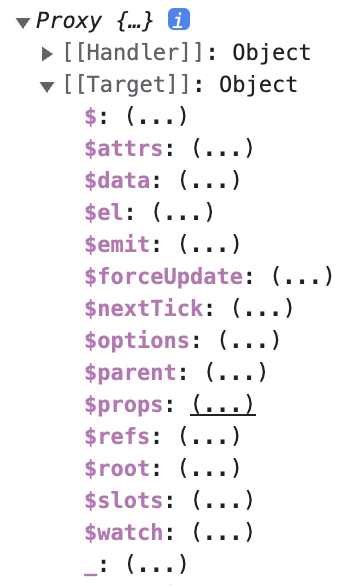

## Refs

### Refs
- 특정한 요소나 컴포넌트를 참조할 수 있는 개념

```vue
<template>
  <h1 id="hello">
    Hello World!
  </h1>
</template>

<script>
export default {
  mounted() {
    const h1El = document.querySelector('#hello')
    console.log(h1El.textContent)
  }
}
</script>
```

#### 위와 같은 코드를 간략화

- `ref`는 reference(참조)의 약어
    - 특정한 요소를 hello라는 이름으로 참조하겠다는 의미
- `this.$refs.hello`는 `h1` 태그 자체를 나타냄 내용을 출력하려면 `textContent` 추가
- `ref` 통해서 해당하는 요소를 참조, 참조된 내용은 `$ref` 객체에 지정한 이름으로 들어가 저장

```vue
<template>
  <h1 ref="hello">
    Hello World!
  </h1>
</template>

<script>
export default {
  mounted() {
    console.log(this.$refs.hello.textContent)
  }
}
</script>
```

- `mounted`는 html과 연결된 직후에만 사용할 수 있으므로 `created` 라이프 사이클 추가하여 `mounted`와 똑같이 작성
    - `undefined` 콘솔에 출력됨
    - `created`는 컴포넌트가 생성된 직후이고, `mounted`는 html 구조에 컴포넌트가 연결된 직후를 뜻하기 때문에 차이가 있음
    - `ref`는 `created`에서는 사용 불가능, `mounted`에서는 사용 가능

```vue
<template>
  <h1 ref="hello">
    Hello World!
  </h1>
</template>

<script>
export default {
  created() {
    console.log(this.$refs.hello)
  },
  mounted() {
    console.log(this.$refs.hello.textContent)
  }
}
</script>
```

<br/>

### 컴포넌트에서 `ref` 사용하기

App.vue

- hello라는 이름으로 Hello 컴포넌트를 참고하겠다는 뜻으로 `ref` 사용

```vue
<template>
  <Hello ref="hello" />
</template>

<script>
import Hello from '~/components/Hello'

export default {
  components: {
    Hello
  },
  mounted() {
    console.log(this.$refs.hello.$el)
  }
}
</script>
```

Hello.vue

```vue
<template>
  <h1>Hello~</h1>
</template>
```

<br/>

개발 서버 열어 콘솔 확인

- `$el`: 해당 컴포넌트의 최상위 컴포넌트
    - Hello.vue에서는 `h1` 태그
    - 고로 h1 요소 내용이 출력됨



<br/>

Hello.vue에 `h1` 태그 추가

```vue
<template>
  <h1>Hello~</h1>
  <h1 ref="good">
    Good?
  </h1>
</template>
```

App.vue

- 콘솔에서 `h1` 요소 확인 가능

```vue
<template>
  <Hello ref="hello" />
</template>

<script>
import Hello from '~/components/Hello'

export default {
  components: {
    Hello
  },
  mounted() {
    console.log(this.$refs.hello.$refs.good)
  }
}
</script>
```