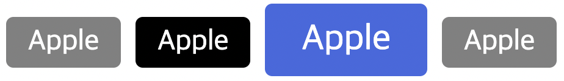
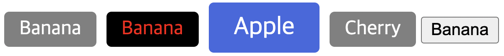

## 컴포넌트 기초

App.vue

- `color` 속성에는 `MyBtn`에서 데이터 타입을 `String`으로 받고 있기 때문에 '123'과 같은 숫자 데이터를 입력할 경우 색상이 나타나지 않음
- #000과 같은 색상 코드로 작성해야 색상 나타남

```jsx
<template>
  <MyBtn />
  <MyBtn color="royalblue" />
  <MyBtn />
  <MyBtn />
</template>

<script>
import MyBtn from '~/components/MyBtn'

export default {
  components: {
    MyBtn
  }
}
</script>
```

MyBtn.vue

- `Props`
    - App.vue에서 두 번째 `MyBtn`에서 추가한 `color`라는 속성을 받아 `MyBtn`에서 작동될 수 있도록 추가해 주어야 함
    - 컴포넌트가 실행될 때 마치 속성처럼 받아 내는 내용들을 정의해 주는 옵션
    - App이라는 부모 컴포넌트에서 `MyBtn`이라는 자식 컴포넌트로 특정 데이터를 전달하는 데 쓰는 용도라고 해서 **`부모 - 자식 데이터 통신 방법`**이라고도 함
- `color`라는 `props`가 버튼에 적용될 수 있도록 `style` 속성을 데이터 바인딩 형식으로 추가하여 `props`에 해당하는 `color` 데이터를 `backgroudnColor`로 연결함

```jsx
<template>
  <div
    :style="{ backgroundColor: color }"
    class="btn">
    Apple
  </div>
</template>

<script>
export default {
  props: {
    color: {
      type: String,
      default: 'gray'
    }
  }
}
</script>

<style scoped>
  .btn {
    display: inline-block;
    margin: 4px;
    padding: 6px 12px;
    border-radius: 4px;
    background-color: gray;
    color: white;
    cursor: pointer;
  }
</style>
```


<br/>

#### 세 번째 버튼에 `large` 속성 추가

App.vue

- 두 번째 버튼의 색상 지정 코드를 양방향 데이터 바인딩 형식으로 수정
- 세 번째 버튼에 `large` `color` 두 개의 속성 사용 가능

```jsx
<template>
  <MyBtn />
  <MyBtn :color="color" />
  <MyBtn
    large
    color="royalblue" />
  <MyBtn />
</template>

<script>
import MyBtn from '~/components/MyBtn'

export default {
  components: {
    MyBtn
  },
  data() {
    return {
      color: '#000'
    }
  }
}
</script>
```

MyBtn.vue

- `props`에 `large`를 추가, `style` 안에서도 `large`가 동작할 경우의 스타일을 지정해 줌

```jsx
<template>
  <div
    :class="{ large }"
    :style="{ backgroundColor: color }"
    class="btn">
    Apple
  </div>
</template>

<script>
export default {
  props: {
    color: {
      type: String,
      default: 'gray'
    },
    large: {
      type: Boolean,
      default: false
    }
  }
}
</script>

<style scoped lang="scss">
  .btn {
    display: inline-block;
    margin: 4px;
    padding: 6px 12px;
    border-radius: 4px;
    background-color: gray;
    color: white;
    cursor: pointer;
    &.large {
    font-size: 20px;
    padding: 10px 20px;
  }
 }

</style>
```



<br/>

### 버튼의 이름 변경하기

App.vue

- 버튼의 이름을 `MyBtn` 태그 사이에 입력하여 출력
- 두 번째 버튼은 글자 색상 지정

```jsx
<template>
  <MyBtn>Banana</MyBtn> 
  <MyBtn
    :color="color">
    <span style="color: red">Banana</span>
  </MyBtn>
  <MyBtn
    large
    color="royalblue">
    Apple
  </MyBtn>
  <MyBtn>Cherry</MyBtn>
  <button>Banana</button>
</template>

<script>
import MyBtn from '~/components/MyBtn'

export default {
  components: {
    MyBtn
  },
  data() {
    return {
      color: '#000'
    }
  }
}
</script>
```

MyBtn.vue

- `slot`: 단순하게 텍스트만 받아 출력하는 것이 아니라 컴포넌트가 실행되는 부분에서 태그가 열리고 닫히는 부분의 모든 내용을 `slot`으로 대체하여 넣어 줌
    - App.vue 파일의 `<span style="color: red">Banana</span>` 내용, `Apple`, `Cherry`, `Banana`가 `slot`으로 대체되어 들어간다는 뜻

```jsx
<template>
  <div
    :class="{ large }"
    :style="{ backgroundColor: color }"
    class="btn">
    <slot></slot>
  </div>
</template>

<script>
export default {
  props: {
    color: {
      type: String,
      default: 'gray'
    },
    large: {
      type: Boolean,
      default: false
    }
  }
}
</script>

<style scoped lang="scss">
  .btn {
    display: inline-block;
    margin: 4px;
    padding: 6px 12px;
    border-radius: 4px;
    background-color: gray;
    color: white;
    cursor: pointer;
    &.large {
    font-size: 20px;
    padding: 10px 20px;
  }
}
</style>
```

