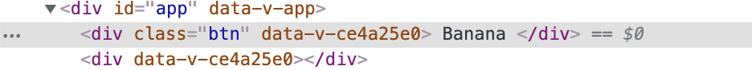

## 컴포넌트 - 속성 상속

### 상속

- 컴포넌트가 사용되는 곳에 작성해 둔 클래스나 기타 여러 속성들이 컴포넌트 내부에 있는 하나의 요소에 연결되는 것

예제

App.vue

```vue
<template>
  <MyBtn class="heropy">
    Banana
  </MyBtn>
</template>

<script>
import MyBtn from '~/components/MyBtn'

export default {
  components: {
    MyBtn
  }
}
</script>
```

MyBtn.vue

```vue
<template>
  <div class="btn">
    <slot></slot>
  </div>
  <div></div>
</template>

<script>
export default {

}
</script>

<style scoped>
  .btn {
    display: inline-block;
    margin: 4px;
    padding: 6px 12px;
    border-radius: 4px;
    background-color: gray;
    color: white;
    cursor: pointer;
  }
</style>
```

결과

- 회색 배경에 흰 글씨로 Banana라 쓰여진 버튼 생성
- 개발자 도구 확인 시 `btn heropy` 클래스의 `div` 태그 밑에 `div` 태그를 추가했을 때와 추가하지 않았을 때 차이가 있음
    - 추가 전: `btn heropy` 클래스를 가진 `div` 요소 확인 가능
    
    
    
    - 추가 후: 사라짐
    
    
    
    - 이유: `template`의 자식 요소를 해당하는 컴포넌트의 최상위 요소(루트 요소)라고 부름 `template` 아래에 `btn heropy` 클래스의 `div`와 그냥 `div` 요소, 총 두 개가 존재함 즉, 최상위 요소가 두 개인 것이므로 컴포넌트에 사용될 속성들이 어느 요소에 들어가야 하는지 모르기 때문에 어떠한 곳에도 들어가지 않고 화면에 렌더링됨
    - `btn` 클래스를 가진 요소는 컴포넌트가 사용되는 곳에서 `heropy` 클래스를 가진 요소를 상속받아 출력하는 것

<br/>

### 속성 추가

App.vue

- 글자 색상 red로 지정
- `MyBtn` 안에 최상위 요소가 하나기 때문에 해당 요소에 속성 적용됨
- `div` 요소나 `h2` 등 최상위 요소를 여러 개 만들 경우 스타일 적용 안 됨

```vue
<template>
  <MyBtn
    class="heropy"
    style="color: red">
    Banana
  </MyBtn>
</template>
```
화면  
  
개발자 도구  


<br/>

### 하나의 방식으로 통일하는 방법

MyBtn.vue

- `inheritAttrs` 옵션 추가
    - 상속 지정을 false, 즉 상속하지 않도록 선언
- 스타일 속성이 적용되지 않는 것을 확인 가능

```vue
<template>
  <div class="btn">
    <slot></slot>
  </div>
</template>

<script>
export default {
  inheritAttrs: false
}
</script>

<style scoped>
  .btn {
    display: inline-block;
    margin: 4px;
    padding: 6px 12px;
    border-radius: 4px;
    background-color: gray;
    color: white;
    cursor: pointer;
  }
</style>
```
화면  
  
개발자 도구  


<br/>

### 컴포넌트의 속성들을 특정 요소에다 직접 연결하고 싶을 때

MyBtn.vue

- `create()` 라이프 사이클을 추가 후 `$attrs`로 속성 출력
- 개발자 도구를 통해 class는 heropy, style은 red라는 내용이 `$attrs`에 저장되어 확인 가능

```vue
<script>
export default {
  inheritAttrs: false,
  created() {
    console.log(this.$attrs)
  }
}
</script>
```


<br/>

### `h1`에 데이터 연결

MyBtn.vue

- `$attrs.class`를 통해 `attrs` 안에 있는 `class`의 내용을 가지고 옴
- `$attrs.style`을 통해 `attrs` 안에 있는 `style`의 내용을 가지고 옴

```vue
<template>
  <div class="btn">
    <slot></slot>
  </div>
  <h1
    :class="$attrs.class"
    :style="$attrs.style">
  </h1>
</template>
```


<br/>

### 하나의 요소에 모든 내용을 작성

- 해당 컴포넌트 부분에 여러 속성을 추가할 때마다 따로 명시를 해 줄 필요 없이 추가되는 내용이 바로 `h1` 태그에 반영됨

```vue
<template>
  <div class="btn">
    <slot></slot>
  </div>
  <h1 v-bind="$attrs"></h1>
</template>
```

