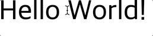
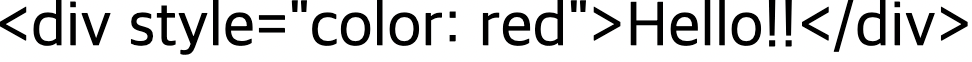
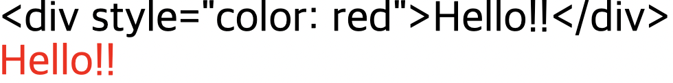

## 템플릿 문법

[vue3의 템플릿 문법에 대한 문서](https://v3.ko.vuejs.org/guide/template-syntax.html#%E1%84%87%E1%85%A9%E1%84%80%E1%85%A1%E1%86%AB%E1%84%87%E1%85%A5%E1%86%B8-interpolation)

### 보간법
### 1. 문자열

- `v-once` 디렉티브를 사용하여 데이터가 변경되어도 갱신되지 않는 일회성 보간 수행
- 같은 노드의 바인딩에 영향 미친다는 점 유의

예시

```jsx
<template>
  <h1 @click="add">
    {{ msg }}
  </h1>
</template>

<script>
export default {
  data() {
    return {
      msg: 'Hello World!'
    }
  },
  methods: {
    add() {
      this.msg += '!'
    }
  }
}
</script>
```


<br/>

template에 `v-once` 추가

- html의 속성처럼 사용
- 한 번만 렌더링, 다음부터는 데이터가 변경되더라도 갱신하지 않음
    - 반응성을 가지지 않는다

```jsx
<template>
  <h1
    v-once
    @click="add">
    {{ msg }}
  </h1>
</template>
```



---

### 2. 원시 HTML

- 이중 중괄호는 데이터를 HTML이 아닌 일반 텍스트로 해석
- `v-html` 디렉티브를 사용해야 함

```jsx
<p>이중 중괄호 사용: {{ rawHtml }}</p>
<p>v-html 디렉티브 사용: <span v-html="rawHtml"></span></p>
```

<br/>

예시

- 개발자 도구로 h1 태그에 텍스트로 div 태그 내용이 들어가 있음을 확인 가능
- html 코드로 해당 내용 삽입 시 이중 중괄호 사용 불가능
    - `v-html` 사용해야 함

```jsx
<template>
  <h1
    v-once
    @click="add">
    {{ msg }}
  </h1>
</template>

<script>
export default {
  data() {
    return {
      msg: '<div style="color: red">Hello!!</div>'
    }
  },
  methods: {
    add() {
      this.msg += '!'
    }
  }
}
</script>
```



<br/>

template에 `v-html` 추가

- 두 번째 h1 태그가 html 코드로 읽혀져 스타일 속성이 적용되어 나타남

```jsx
<template>
  <h1
    v-once
    @click="add">
    {{ msg }}
  </h1>
  <h1 v-html="msg">
  </h1>
</template>
```



---

### 3. 속성

- 이중 중괄호 구문은 HTML 속성에 사용할 수 없음
- 대신 `v-bind` 디렉티브 사용

```jsx
<div v-bind:id="dynamicId"></div>
```

`v-on`

- `v-on:click`의 약어가 `@click`

```jsx
<!-- 전체 문법 -->
<a v-on:click="doSomething"> ... </a>

<!-- 약어 -->
<a @click="doSomething"> ... </a>

<!-- 동적 전달인자와 함께 쓴 약어 -->
<a @[event]="doSomething"> ... </a>
```

<br/>

예시 

- `v-bind: class="msg"` 입력 후 저장 시 `v-bind`가 사라짐
    - 약어로 작동된 것

```jsx
<template>
  <h1 :class="msg">
    {{ msg }}
  </h1>
</template>

<script>
export default {
  data() {
    return {
      msg: 'active'
    }
  },
  methods: {
    add() {
      this.msg += '!'
    }
  }
}
</script>

<style scoped>
  .active {
    color: royalblue;
    font-size: 100px;
  }
</style>
```


<br/>

`attr` 데이터 추가

- `attr`의 내용이 `class`이므로 h1에서 `[attr]="msg"`는 `class="msg"`와 동일한 뜻으로 받아들여짐
    - 실제 데이터로 속성의 이름을 대체하여 사용 가능

```jsx
<template>
  <h1 :[attr]="msg">
    {{ msg }}
  </h1>
</template>

<script>
export default {
  data() {
    return {
      msg: 'active',
      attr: 'class'
    }
  },
  methods: {
    add() {
      this.msg += '!'
    }
  }
}
</script>
```

<br/>

`event` 데이터 추가

- `@[event]="add"`가 `@click="add"`로 받아들여짐
- `click` 속성을 `event`라는 데이터로 대체하였기 때문

```jsx
<template>
  <h1 
    :[attr]="msg"
    @[event]="add">
    {{ msg }}
  </h1>
</template>

<script>
export default {
  data() {
    return {
      msg: 'active',
      attr: 'class',
      event: 'click'
    }
  },
  methods: {
    add() {
      this.msg += '!'
    }
  }
}
</script>
```

실행

- 클릭 시 스타일 적용 안 되는 이유
    - 누를 때마다 느낌표 추가되면서 클래스 이름도 함께 변화하는데, 이에 대한 스타일을 정의하지 않았기 때문


<br/>

코드 수정 후 결과

- `msg` 데이터의 `active`를 작은 따옴표로 묶어서 실제로 삽입하면 문자 데이터로 인식되므로 `msg` 데이터의 영향을 받지 않게 됨

```jsx
<template>
  <h1 
    :[attr]="'active'"
    @[event]="add">
    {{ msg }}
  </h1>
</template>

<script>
export default {
  data() {
    return {
      msg: 'active',
      attr: 'class',
      event: 'click'
    }
  },
  methods: {
    add() {
      this.msg += '!'
    }
  }
}
</script>

<style scoped>
  .active {
    color: royalblue;
    font-size: 100px;
  }
</style>
```

