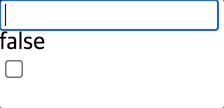
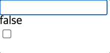

## 폼 입력 바인딩

### 단방향 데이터 바인딩

동작

- `msg` 데이터를 생성하여 문자를 작성한 후 `value`와 연결해 줌
    - 데이터를 연결할 때는 속성 앞에 `v-bind`를 이용하여 `v-bind:value="msg"`처럼 사용해야 하는데 `:value-"msg"`로 약어 사용
- JS의 `msg`가 HTML의 `msg`로, 한 방향으로 바인딩
- `input` 요소 안에 출력되는 Hello World를 수정하더라도 원본 메시지가 수정되지 않음
    - 수정했을 때 h1 태그도 수정되어야 하나 원본 메시지가 그대로 출력되는 것으로 확인 가능

```vue
<template>
  <h1>{{ msg }}</h1>
  <input
    type="text"
    :value="msg" />
</template>

<script>
export default {
  data() {
    return {
      msg: 'Hello World!'
    }
  }
}
</script>
```

<br/>

### 양방향 데이터 바인딩

- `input` 이벤트를 추가하여 `input` 요소에서 이벤트가 발생할 경우 `handler`가 실행되도록 함
    - `input` 요소에서 입력된 내용을 `msg`에 할당
    - `h1`의 `msg` 요소에도 영향을 미쳐 입력한 내용대로 변경됨
    - 반응성을 띄게 됨

```vue
<template>
  <h1>{{ msg }}</h1>
  <input
    type="text"
    :value="msg"
    @input="handler" />
</template>

<script>
export default {
  data() {
    return {
      msg: 'Hello World!'
    }
  },
  methods: {
    handler(event) {
      console.log(event.target.value)
      this.msg= event.target.value
    }
  }
}
</script>
```

- 인라인 방식으로 간략하게 작성 가능

```vue
<template>
  <h1>{{ msg }}</h1>
  <input
    type="text"
    :value="msg"
    @input="msg = $event.target.value" />
</template>

<script>
export default {
  data() {
    return {
      msg: 'Hello World!'
    }
  }
}
</script>
```

<br/>

### `v-model` 

- 디렉티브로 양방향 데이터 바인딩 가능

```vue
<template>
  <h1>{{ msg }}</h1>
  <input
    type="text"
    :value="msg"
    v-model="msg" />
</template>
```

- 체크박스와 같은 다른 `input` 요소들에 데이터를 쉽게 연결 가능

```vue
<template>
  <h1>{{ msg }}</h1>
  <input
    type="text"
    v-model="msg" />
  <h1>{{ checked }}</h1>
  <input
    type="checkbox"
    v-model="checked" />
</template>

<script>
export default {
  data() {
    return {
      msg: 'Hello World!',
      checked: false
    }
  }
}
</script>
```

- 한글 입력 시에는 하나의 글자가 작성되기 전까지는 자음 모음 하나씩 바로 반영되지 않음



- 단방향 데이터 바인딩이 되도록 인라인 형식으로 작성하면 해결 가능

```vue
<template>
  <h1>{{ msg }}</h1>
  <input
    type="text"
    :value="msg"
    @input="msg = $event.target.value" />
  <h1>{{ checked }}</h1>
  <input
    type="checkbox"
    v-model="checked" />
</template>
```


