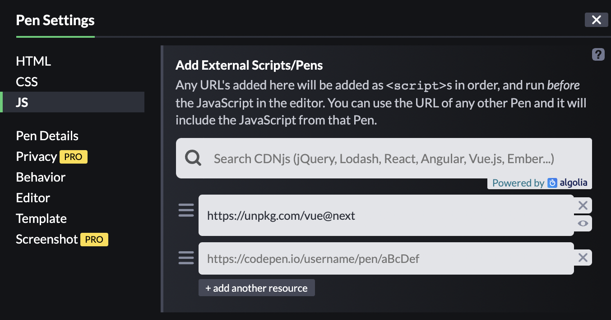

## CDN
[Vue.js의 릴리즈 노트](https://github.com/vuejs/vue-next/blob/master/CHANGELOG.md)

CDN
```html
<script src="https://unpkg.com/vue@next"></script>
```

풍성하게 사용하려면 Npm 프로젝트로 설치하여 사용

```bash
# latest stable
$ npm install vue@next
```

<br/>

예제

html

```html
<script src="https://unpkg.com/vue@next"></script>
<div id="opp">
  <h1>{{ message }}</h1>
</div>
```

JS

```jsx
Vue.createApp({
  data() {
    return {
      message: 'Hello Vue!'
    }
  }
}).mount('#opp')
// id 값에 css 선택자를 명시하면 vue.js가 html에서 vue.js의 문법을 사용할 수 있도록 함
```


- message 데이터를 html에서 받아 화면에 출력
- message 데이터를 수정하면 갱신된 내용이 바로 반영되어 출력  
  → 반응성(Reactivity)
    

## Codepen

script 태그로 Vue 연결하지 않고 Codepen 사용하기

- JS 설정으로 들어가 Add External Scripts/Pens 항목에 script 주소 입력

