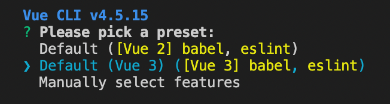

## CLI

[Vue.js CLI에 대한 문서](https://cli.vuejs.org/)

CLI 설치

1. npm 프로젝트로 Vue CLI를 사용하기 위한 설치

```bash
npm i -g @vue/cli
# -g 플래그는 전역 설치라는 뜻
```

설치 결과로 `vue` 명령어를 사용할 수 있게 된다

```bash
vue create hello-world
# hello-world라는 이름의 vue 프로젝트 생성
# vue3 create 사용할 경우 vue의 3 버전이 설치됨
```

<br/>

2. 화살표 키 이용하여 Vue3 선택 후 설치



```bash
# 프로젝트 경로로 cd 이용해 이동 후 현재 창에서 프로젝트 띄우기
code . -r
```

<br/>

package-json

- `serve`: `dev`와 같음 (`npm run serve`로 개발 서버 오픈 가능)
- `build`: 제품화 과정 (`npm run build`)
- `lint`: vue.js 코드를 일정한 규칙에 맞게 확인
    - 해당하는 규칙이 `eslintConfig` 옵션으로 명시되어 있음
    - `rules` 옵션에 사용자화 코드 추가 가능
- vue는 webpack을 내부적으로 사용하고 있음
    - 옵션은 프로젝트 내에서 숨겨져 있으나 `vue-cli-service`로 제공 중

```bash
"scripts": {
    "serve": "vue-cli-service serve",
    "build": "vue-cli-service build",
    "lint": "vue-cli-service lint"
  },
```

<br/>

main.js

- `createApp`과 `mount`의 메소드 체이닝 코드 앞에 Vue 객체 생략
    - 패키지에서 vue를 import 하여 사용하고 있음
- mount에서 html의 id 요소인 app을 css 선택자로 명시하여 vue.js로 연결
- App 이름으로 ./App.vue 파일 내용 import 하고 있음

```jsx
import { createApp } from 'vue'
import App from './App.vue'

createApp(App).mount('#app')
```

## Vetur

- `App.vue` 파일 확인 시 코드 하이라이팅이 되어 있지 않아 가독성이 떨어지므로 `Vetur` 확장 프로그램 설치
- VS Code에서 vetur 검색하여 설치
- `App.vue`는 template, script, style 세 부분으로 나눠져 있음
    - template에는 HTML, script에는 JS, style에는 CSS 내용 작성