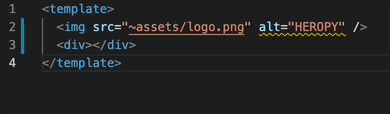

## ESLint

[eslint-plugin-vue에 관한 문서](https://eslint.vuejs.org/user-guide/)

<br/>

패키지 설치

```bash
npm i -D eslint eslint-plugin-vue babel-eslint
```

`.eslintrc.js` 파일 생성

```jsx
module.exports = {
  env: {
    // browser와 node.js의 전역 개념들을 모두 코드 검사 할 것인지
    browser: true,
    node: true
  },
  extends: [
    // vue
    // eslint-plugin-vue에서 제공하는 기본적인 코드 규칙
    // 'plugin:vue/vue3-essential',  // Lv1
    'plugin:vue/vue3-strongly-recommended', // Lv2
    // 'plugin:vue/vue3-recommended', // Lv3, 가장 엄격한 규칙

    // js
    'eslint:recommended'  
    // eslint에서 권장하는 기본적인 코드 규칙으로 js 문법 검사
  ],
  parseOptions: {
    // 분석기 지정
    parser: 'babel-eslint'
  },
  rules: {
    // extends에서 기본 제공 규칙을 그대로 사용하는 경우 옵션 제공하지 않아도 됨
    // 사용자화해야 하는 상황일 경우 추가
  }
}
```

<br/>

VS Code의 상태 표시줄에 eslint가 켜지도록 설정한 뒤 HelloWorld.vue 수정

- 수정 전

```jsx
<template>
  
</template>
```

- eslint 규칙에 맞게 수정

```jsx
<template>
  
</template>
```

`eslint-plugin-vue`의 newline 옵션 확인

- [site](https://eslint.vuejs.org/rules/html-closing-bracket-newline.html#options)
- `singleline`: 한 줄로 작성할 때 `>`를 줄 바꿈 처리 할 것인가
- `multiline`: 여러 줄로 작성할 때 `>`를 새로운 줄에 작성하도록 할 것인가

```jsx
{
  "vue/html-closing-bracket-newline": ["error", {
    "singleline": "never",
    "multiline": "always"
  }]
}
```

<br/>

`.eslintrc.js` 파일의 `rules` 항목에 위의 코드 복사 후 수정

- 한 줄로 작성할 때나 여러 줄로 작성할 때 모두 `>` 줄 바꿈 처리 하지 않음

```jsx
rules: {
    // extends에서 기본 제공 규칙을 그대로 사용하는 경우 옵션 제공하지 않아도 됨
    // 사용자화해야 하는 상황일 경우 추가
    "vue/html-closing-bracket-newline": ["error", {
      "singleline": "never",
      "multiline": "never"
    }]
  }
```

<br/>

HelloWorld.vue

- 아래와 같이 실행해도 오류 없음

```jsx
<template>
  
</template>
```

<br/>

[vue/html-self-closing](https://eslint.vuejs.org/rules/html-self-closing.html#vue-html-self-closing)

- Options
    - `void`: 빈 태그에 / 기호 넣을 것인가
    - `normal`: 일반적으로 빈 태그에 /를 삽입할 것인가 (ex, <div />)
    - `component`: 내용이 없는 경우 빈 태그처럼 작성할 것인가

```jsx
{
  "vue/html-self-closing": ["error", {
    "html": {
      "void": "never",
      "normal": "always",
      "component": "always"
    },
    "svg": "always",
    "math": "always"
  }]
}
```

`.eslintrc.js` 파일에 코드 추가 후 변경

```jsx
'vue/html-self-closing': ['error', {
      html: {
        void: 'always',
        normal: 'always',
        component: 'always'
      },
      svg: 'always',
      math: 'always'
    }]
```

<br/>

수정 후 HelloWorld.vue

- 슬래시를 넣어도 오류 없음

```jsx
<template>
  
</template>
```

- 빈 태그 추가
    - div 요소는 열리고 닫히는 구조를 가지고 있으므로 어색해 보임

```jsx
<template>
  
	// <div></div> 오류
  <div />
</template>
```

<br/>

.eslintrc.js 수정

- 일반 태그에는 슬래시 기호 넣지 않아도 오류 발생 안함

```jsx
'vue/html-self-closing': ['error', {
      html: {
        void: 'always',
        normal: 'never',
        component: 'always'
      },
```

<br/>

수정 후 HelloWorld.vue

```jsx
<template>
  
  <div></div>
	// <div /> 오류
</template>
```

<br/>

ESLint 문법에 맞게 자동 수정해 주도록 설정

- VS Code에서 cmd + shift + P(Mac) 키를 눌러 검색창을 띄운 후 기본 설정: 설정 열기(JSON)을 찾아서 settings.json 파일 열기

```jsx
"editor.codeActionsOnSave": {
        "source.fixAll.eslint": true
}
```

- 상태표시줄에 ESLint 표시되지 않을 경우 설정

```jsx
"eslint.alwaysShowStatus": true
```

