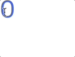

## 선언적 랜더링과 입력 핸들링

앞에서 만든 템플릿 불러오기

```bash
npm degit plutoin/vue3-webpack-template vue3-test
npm i 
# node_ modules 설치
```

<br/>

Vue 파일의 구조

- `.vue`라는 확장자로 만들어진 하나의 파일을 싱글 파일 컴포넌트라고 지칭

```jsx
// HTML 내용 명시, Vue의 문법 사용 궈장
<template>

</template>

// JS 내용 명시, Vue의 문법 사용 권장
<script>
export default {
  
}
</script>

// SCSS에 대한 내용 명시
<style>

</style>
```

<br/>

App.vue 파일 작성

- 0을 `count`에 넣어서 html 태그의 `count`로 전달 후 출력

```jsx
<template>
  <h1>{{ count }}</h1>
</template>

<script>
export default {
  data() {
    return {
      count: 0
    }
  }
}
</script>

<style>
  h1 {
    font-size: 50px;
    color: royalblue;
  }
</style>
```


- 숫자를 클릭할 때마다 1씩 증가하도록 작성
    - `increase` 함수 생성해서 `this.count`로 미리 만들어진 `count` 변수를 가지고 와 1씩 증가하도록 작성
    - h1 태그를 클릭하면 작동하도록 `@click` 속성 추가 후 method 옵션의 `increase` 함수를 값으로 불러 옴
    - 데이터를 정의하고 갱신할 수 있는 이벤트의 핸들러 작성됨
    - 반응성(Reactivity): 데이터를 갱신하면 연결되어 있는 브라우저의 화면도 갱신됨

```jsx
<template>
  <h1 @click="increase">
    {{ count }}
  </h1>
</template>

<script>
export default {
  data() {
    return {
      count: 0
    }
  },
  methods: {
    increase() {
      this.count += 1
    }
  }
}
</script>

<style>
  h1 {
    font-size: 50px;
    color: royalblue;
  }
</style>
```

