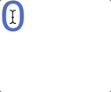
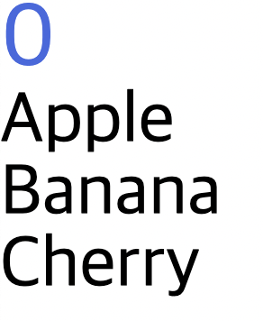

## 조건문과 반복문

App.vue

- 숫자 클릭 시 4보다 더 커지면 지정 문구가 나타나도록 작성

```vue
<template>
  <h1 @click="increase">
    {{ count }}
  </h1>
  <div v-if="count > 4">
    4보다 큽니다!
  </div>
</template>

<script>
export default {
  data() {
    return {
      count: 0
    }
  },
  methods: {
    increase() {
      this.count += 1
    }
  }
}
</script>

<style>
  h1 {
    font-size: 50px;
    color: royalblue;
  }
</style>
```



- fruits라는 반복되는 배열 생성
- `v-for`라는 반복문에 fruits를 명시, fruit라는 변수에 반복되는 데이터 할당
- 데이터를 반복할 때는 데이터가 고유한지 증명하기 위해 `:key` 속성 사용
    - 예제에서는 Apple, Banana, Cherry가 각각 한 번씩 들어가는 것을 증명하게 됨

```vue
<template>
  <h1 @click="increase">
    {{ count }}
  </h1>
  <div v-if="count > 4">
    4보다 큽니다!
  </div>
  <ul>
    <li
      v-for="fruit in fruits"
      :key="fruit">
      {{ fruit }}
    </li>
  </ul>
</template>

<script>
export default {
  data() {
    return {
      count: 0,
      fruits: ['Apple', 'Banana', 'Cherry']
    }
  },
  methods: {
    increase() {
      this.count += 1
    }
  }
}
</script>

<style lang="scss">
  h1 {
    font-size: 50px;
    color: royalblue;
  }
  ul {
    li {
      font-size: 40px;
    }
  }
</style>
```

<br/>

#### Fruit라는 Vue.js 파일을 만들어 App.vue에서 연결 후 사용해 보기

Fruit.vue 파일 생성

- `name`이라는 이름으로 String 타입의 데이터를 받음
    - 데이터가 들어오지 않으면 빈 문자 사용하겠다는 뜻

```vue
<template>
  <li>{{ name }}</li>
</template>

<script>
export default {
  props: {
    name: {
      type: String,
      default: ''
    }
  }
}
</script>
```

<br/>

App.vue 파일 수정

- Fruit.vue를 가지고 오기 위해 script 태그 안에서 import문 작성
    - 틸더 기호로 앞의 경로 생략 가능
    - 해당 파일을 App.vue로 사용하기 위해 component로 등록하기 위해 작성 후 Fruit라는 이름으로 사용하도록 작성
    - 속성의 이름과 데이터 이름이 같을 경우 Fruit: Fruit에서 콜론 뒤를 생략 가능
- `template` 태그 안의 `li` 태그 이름을 Fruit로 변경 후 `:name` 속성 추가 후 fruit 데이터 명시

```vue
<template>
  <h1 @click="increase">
    {{ count }}
  </h1>
  <div v-if="count > 4">
    4보다 큽니다!
  </div>
  <ul>
    <Fruit
      v-for="fruit in fruits"
      :key="fruit"
      :name="fruit">
      {{ fruit }}
    </Fruit>
  </ul>
</template>

<script>
import Fruit from '~/components/Fruit'

export default {
  components: {
    Fruit
  },
  data() {
    return {
      count: 0,
      fruits: ['Apple', 'Banana', 'Cherry']
    }
  },
  methods: {
    increase() {
      this.count += 1
    }
  }
}
</script>

<style lang="scss">
  h1 {
    font-size: 50px;
    color: royalblue;
  }
  ul {
    li {
      font-size: 40px;
    }
  }
</style>
```



### scoped

Fruit.vue

- style 태그 안에서 scoped를 사용하지 않고 스타일 지정 시 연결되어진 App.vue의 h1 태그 색상이 변경되게 됨
- scoped 사용으로 style 태그의 유효 범위가 현재 컴포넌트 내라는 것을 명시

```vue
<template>
  <li>{{ name }}</li>
</template>

<script>
export default {
  props: {
    name: {
      type: String,
      default: ''
    }
  }
}
</script>

<style scoped lang="scss">
  h1{
    color: red !important;
  }
</style>
```