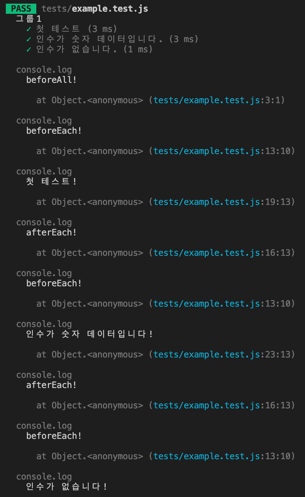
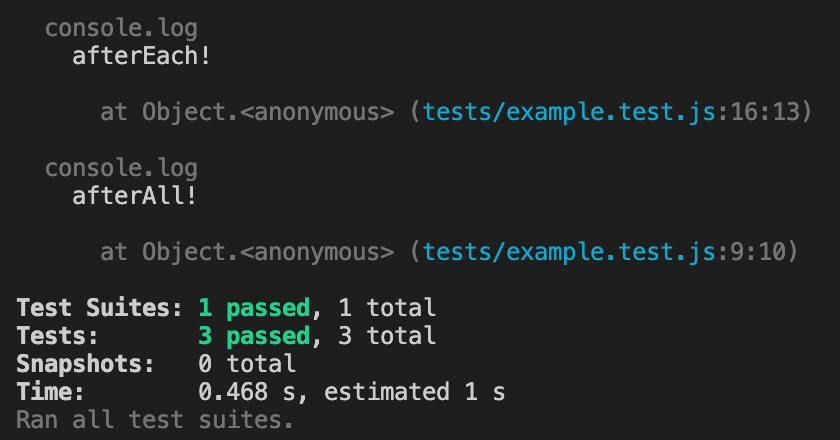

## Jest Globals

[Jest Methods](https://jestjs.io/docs/api)

테스트

- `test` 함수는 각각의 테스트를 구분해 주는 용도로 사용
- 첫 번째 인수로는 테스트의 이름 명시
- 두 번째 인수로는 콜백 함수로 테스트 진행할 로직 작성
- 이와 같은 함수들을 `describe` 함수로 묶어 사용 가능

<br/>

example.test.js

- `describe`로 그룹을 지어 사용하는 이유
    - `before`, `after가` 붙는 전역 함수를 사용하기 위함

```jsx
import { double } from './example'

describe('그룹1', () => {
  test('첫 테스트', () => {
    expect(123).toBe(123)
  })
  
  test('인수가 숫자 데이터입니다.', () => {
    expect(double(3)).toBe(6)
    expect(double(10)).toBe(20)
  })
  
  test('인수가 없습니다.', () => {
    expect(double()).toBe(0)
  })
})
```

- `beforeAll()`: 그룹 안의 모든 테스트가 실행되기 전에 단 한 번만 실행
- `afterAll()`: 그룹 안의 모든 테스트가 실행된 후에 단 한 번만 실행
- `beforeEach()`: 그룹 안의 각각의 테스트가 실행되기 직전에 한 번씩 실행
    - 아래의 코드에서 총 3번 실행됨
- `afterEach()`: 그룹 안의 각각의 테스트가 실행된 이후에 한 번씩 실행
    - 아래의 코드에서 총 3번 실행됨

```jsx
import { double } from './example'

describe('그룹1', () => {
  beforeAll(() => {

  })
  afterAll(() => {

  })

  beforeEach(() => {

  })
  afterEach(() => {
    
  })

  test('첫 테스트', () => {
    expect(123).toBe(123)
  })
  
  test('인수가 숫자 데이터입니다.', () => {
    expect(double(3)).toBe(6)
    expect(double(10)).toBe(20)
  })
  
  test('인수가 없습니다.', () => {
    expect(double()).toBe(0)
  })
})
```

동작

1. `beforeAll` 동작
2. `beforeEach` 동작
3. 첫 테스트 동작
4. `afterEach` 동작
5. `beforeEach` 동작
6. 인수가 숫자 데이터입니다! 테스트 동작
7. `afterEach` 동작
8. `beforeEach` 동작
9. 인수가 없습니다! 테스트 동작
10. `afterEach` 동작
11. `afterAll` 동작

<br/>

사용

- 필요에 따라 테스트 직전 및 직후에 특정 내용 추가, 모든 테스트 직전 및 직후에 특정 내용 추가로 분류하여 작성 가능
- 그룹을 하나 만들었다면 또 다른 그룹 하나 생성 가능 및 하나의 그룹 내부에서 `before`, `after와` 같은 라이프 사이클 추가 가능

```jsx
import { double } from './example'

describe('그룹1', () => {
  beforeAll(() => {
    console.log('beforeAll!')
  })
  afterAll(() => {
    console.log('afterAll!')
  })

  beforeEach(() => {
    console.log('beforeEach!')
  })
  afterEach(() => {
    console.log('afterEach!')
  })

  test('첫 테스트', () => {
    console.log('첫 테스트!')
    expect(123).toBe(123)
  })
  
  test('인수가 숫자 데이터입니다.', () => {
    console.log('인수가 숫자 데이터입니다!')
    expect(double(3)).toBe(6)
    expect(double(10)).toBe(20)
  })
  
  test('인수가 없습니다.', () => {
    console.log('인수가 없습니다!')
    expect(double()).toBe(0)
  })
})
```



