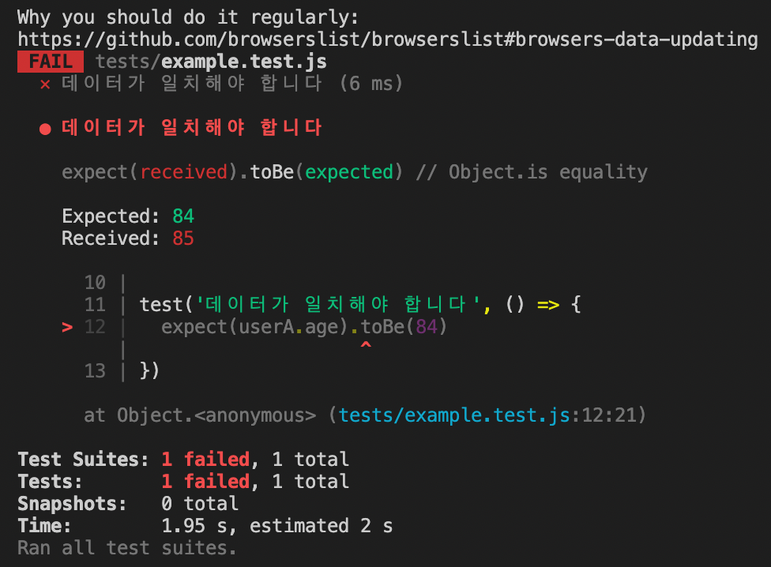
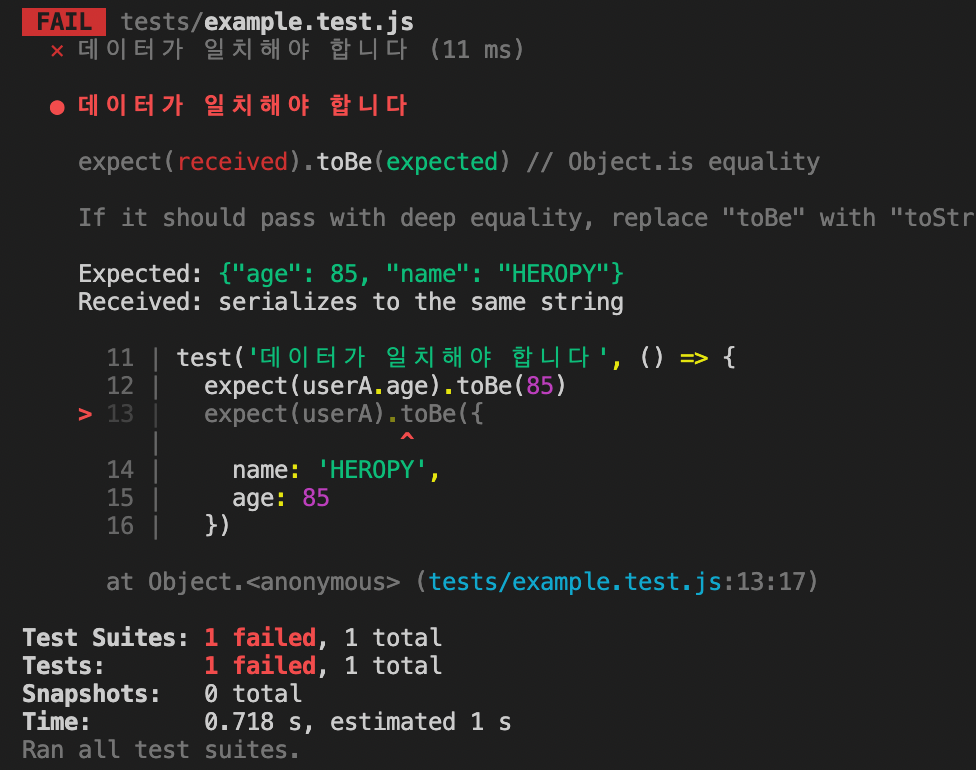
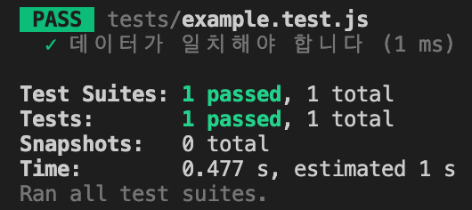
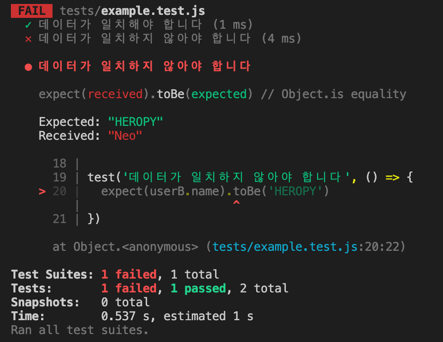
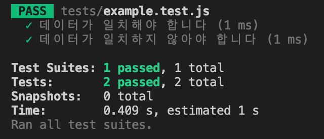

## Jest Matchers
- 기대값과 실제 값을 비교해 주는 메소드들
- 일치도구
- `.not`, `.resolves`, `.rejects`와 같은 브릿지 사용 가능

<br/>

### Jest Expect

- [Docs](https://jestjs.io/docs/expect)

<br/>

### .toBe

- [Docs](https://jestjs.io/docs/expect#tobevalue)
- 원시형 데이터 비교 가능
- 예제
    - `can.ounces`의 값과 12를 비교하여 일치하는지 검사 → 통과
    - `can.name`의 값이 pamplemousse가 맞는지 검사 → 통과

```jsx
const can = {
  name: 'pamplemousse',
  ounces: 12,
};

describe('the can', () => {
  test('has 12 ounces', () => {
    expect(can.ounces).toBe(12);
  });

  test('has a sophisticated name', () => {
    expect(can.name).toBe('pamplemousse');
  });
});
```

<br/>

### .toEqual

- [Docs](https://jestjs.io/docs/expect#toequalvalue)
- 참조형 데이터인 객체 데이터를 비교 가능 (toBe 사용 X)
- 예제
    - `can1`과 `can2`를 비교 (내부적인 구조만 확인) → 통과
    - `can1`과 `can2`를 비교하되 not의 사용으로 부정된 결과값 확인 가능 → 통과

```jsx
const can1 = {
  flavor: 'grapefruit',
  ounces: 12,
};
const can2 = {
  flavor: 'grapefruit',
  ounces: 12,
};

describe('the La Croix cans on my desk', () => {
  test('have all the same properties', () => {
    expect(can1).toEqual(can2);
  });
  test('are not the exact same can', () => {
    expect(can1).not.toBe(can2);
  });
});
```

---

예제 1

- `userA`의 `age`는 85이나 기댓값을 84로 설정했기 때문에 검사 통과 X
- 기댓값으로 85를 입력해야 통과 가능

```jsx
const userA = {
  name: 'HEROPY',
  age: 85
}

const userB = {
  name: 'Neo',
  age: 22
}

test('데이터가 일치해야 합니다', () => {
  expect(userA.age).toBe(84)
})
```



<br/>

예제 2

- 깊은 일치로 통과해야 한다면 `toBe` 대신 `toStrictEqual`을 사용하라는 오류 메시지 확인 가능

```jsx
const userA = {
  name: 'HEROPY',
  age: 85
}

const userB = {
  name: 'Neo',
  age: 22
}

test('데이터가 일치해야 합니다', () => {
  expect(userA.age).toBe(85)
  expect(userA).toBe({
    name: 'HEROPY',
    age: 85
  })
})
```



<br/>

- `toEqual`로도 충분히 해결 가능

```jsx
const userA = {
  name: 'HEROPY',
  age: 85
}

const userB = {
  name: 'Neo',
  age: 22
}

test('데이터가 일치해야 합니다', () => {
  expect(userA.age).toBe(85)
  expect(userA).toEqual({
    name: 'HEROPY',
    age: 85
  })
})
```



<br/>

예제 3

- `userB`의 `name`은 Neo이기 때문에 기댓값인 HEROPY와 일치하지 않으므로 통과 X

```jsx
const userA = {
  name: 'HEROPY',
  age: 85
}

const userB = {
  name: 'Neo',
  age: 22
}

test('데이터가 일치해야 합니다', () => {
  expect(userA.age).toBe(85)
  expect(userA).toEqual({
    name: 'HEROPY',
    age: 85
  })
})

test('데이터가 일치하지 않아야 합니다', () => {
  expect(userB.name).toBe('HEROPY')
})
```



- `not` 브릿지를 사용하면 반대되는 값 출력
- `userB`와 `userA`가 서로 일치하지 않아 통과하지 않는 것이 맞으나 `not`으로 인해 true값을 반환하게 되는 것

```jsx
const userA = {
  name: 'HEROPY',
  age: 85
}

const userB = {
  name: 'Neo',
  age: 22
}

test('데이터가 일치해야 합니다', () => {
  expect(userA.age).toBe(85)
  expect(userA).toEqual({
    name: 'HEROPY',
    age: 85
  })
})

test('데이터가 일치하지 않아야 합니다', () => {
  expect(userB.name).not.toBe('HEROPY')
  expect(userB).not.toBe(userA)
})
```

