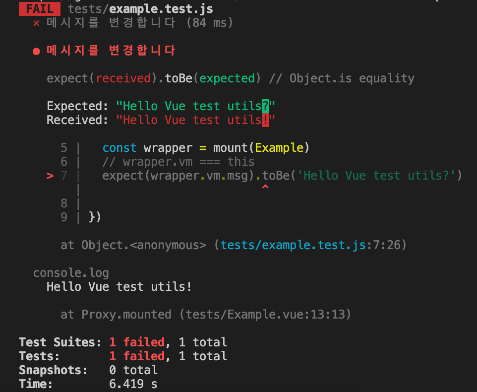
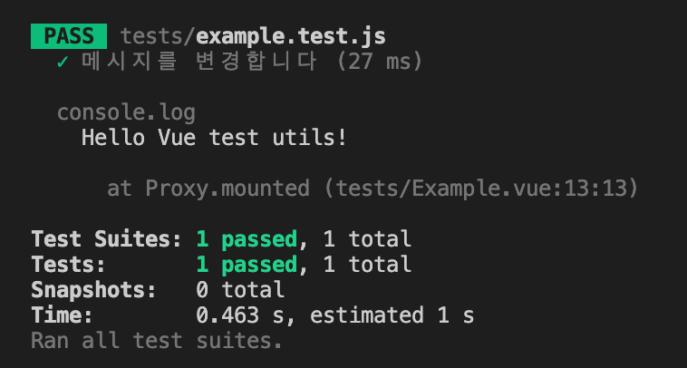

## Vue Test Utils

- [Docs](https://test-utils.vuejs.org/guide/#what-is-vue-test-utils)
- test-utils에서 가지고 온 `mount` 기능을 함수처럼 사용
- 첫 번째 인수로는 컴포넌트, 두 번째 인수로는 옵션
- `msg`라는 속성으로 Hello World를 전달하며 테스트 환경에서 Vue 컴포넌트를 `mount` 하여 사용하겠다는 의미
- `mount`에서 `wrapper` 객체 반환, `wrapper`라는 변수로(동일 이름) 값을 받아 내부에서 테스트할 때 활용
- `toContain`: 앞에 있는 제공된 값에 특정한 문자 데이터가 포함되어 있는지 확인해 주는 matcher
    - `wrapper`의 text 메소드 실행으로 얻은 결과값에서 Hello World라는 글자가 포함되어 있는지 확인해 줌

```jsx
import { mount } from '@vue/test-utils'

// The component to test
const MessageComponent = {
  template: '<p>{{ msg }}</p>',
  props: ['msg']
}

test('displays message', () => {
  const wrapper = mount(MessageComponent, {
    props: {
      msg: 'Hello world'
    }
  })

  // Assert the rendered text of the component
  expect(wrapper.text()).toContain('Hello world')
})
```

<br/>

예제 1

example.test.js

- 테스트 환경에서는 `this` 대신 `wrapper` 객체 안에 있는 `vm` 속성으로 데이터에 접근 가능
    - `wrapper.vm`은 `this`와 동일 기능
- `wrapper.vm.msg`를 통해 `msg` 데이터에 접근하여 `msg` 데이터에 Hello Vue test utils?가 포함되어 있는지 확인
    - 일부러 틀리게 작성하여 확인한 후 utils!로 수정

```jsx
import { mount } from '@vue/test-utils'
import Example from './Example.vue'

test('메시지를 변경합니다', () => {
  const wrapper = mount(Example)
  // wrapper.vm === this
  expect(wrapper.vm.msg).toBe('Hello Vue test utils?')

})
```

Example.vue

- `mounted` 라이프사이클 이용해서 `this.msg`로 `msg` 데이터 접근해 내용 출력

```jsx
<template>
  <div>{{ msg }}</div>
</template>

<script>
export default {
  data() {
    return {
      msg: 'Hello Vue test utils!'
    }
  },
  mounted() {
    console.log(this.msg)
  }
}
</script>
```



<br/>

예제 2

example.test.js

- `msg` 데이터에 접근하여 Hello HEROPY!로 데이터 변경 후 테스트로 두 개의 값이 동일한지 확인

```jsx
import { mount } from '@vue/test-utils'
import Example from './Example.vue'

test('메시지를 변경합니다', () => {
  const wrapper = mount(Example)
  // wrapper.vm === this
  expect(wrapper.vm.msg).toBe('Hello Vue test utils!')
  wrapper.vm.msg = 'Hello HEROPY!'
  expect(wrapper.vm.msg).toBe('Hello HEROPY!')
})
```

- 그러나 변경한 데이터를 그대로 테스트에 활용하여 내용이 무엇인지 확인하는 것은 테스트로써의 가치가 없다고 판단
- `msg` 데이터를 갱신했다고 하면 컴포넌트 내에서 `{{ msg }}`로 데이터를 출력하고 있는 내용도 동일하게 변경되어야 함
- 컴포넌트 내부에 작성된 `div` 요소의 텍스트도 변경이 된 상태인지 테스트로 확인할 수 있도록 함
- Vue.js의 반응성을 통해서 데이터를 갱신하면 화면도 갱신하는 것을 보장해 주어야 하는데 테스트 환경에서는 약간의 차이가 발생할 수 있음
- 단순히 할당 연산자를 이용하는 것이 아닌 `wrapper` 객체의 `setData` 메소드를 통해 데이터 갱신 가능
    - `msg` 데이터를 할당 연산자에서 할당한 문자 그대로 할당
    - `setData`는 비동기로 동작하기 때문에 데이터가 반응성을 가진 상태로 갱신이 되어 화면도 바뀌는 동안 기다려 줌

```jsx
import { mount } from '@vue/test-utils'
import Example from './Example.vue'

test('메시지를 변경합니다', async() => {
  const wrapper = mount(Example)
  // wrapper.vm === this
  expect(wrapper.vm.msg).toBe('Hello Vue test utils!')
  // wrapper.vm.msg = 'Hello HEROPY!'
  await wrapper.setData({
    msg: 'Hello HEROPY!'
  })
  expect(wrapper.vm.msg).toBe('Hello HEROPY!')
  expect(wrapper.find('div').text()).toBe('Hello HEROPY!')
})
```



<br/>

### 요약

- Vue test-utils에서 제공하는 `mount`라는 기능을 통해 테스트 내부에서 사용할 수 있는 `wrapper` 객체 생성 가능
- `wrapper` 통해 데이터로 접근해 데이터를 확인하거나 `wrapper`에서 제공하는 여러 메소드를 통해 컴포넌트를 테스트한 후 결과 확인 가능