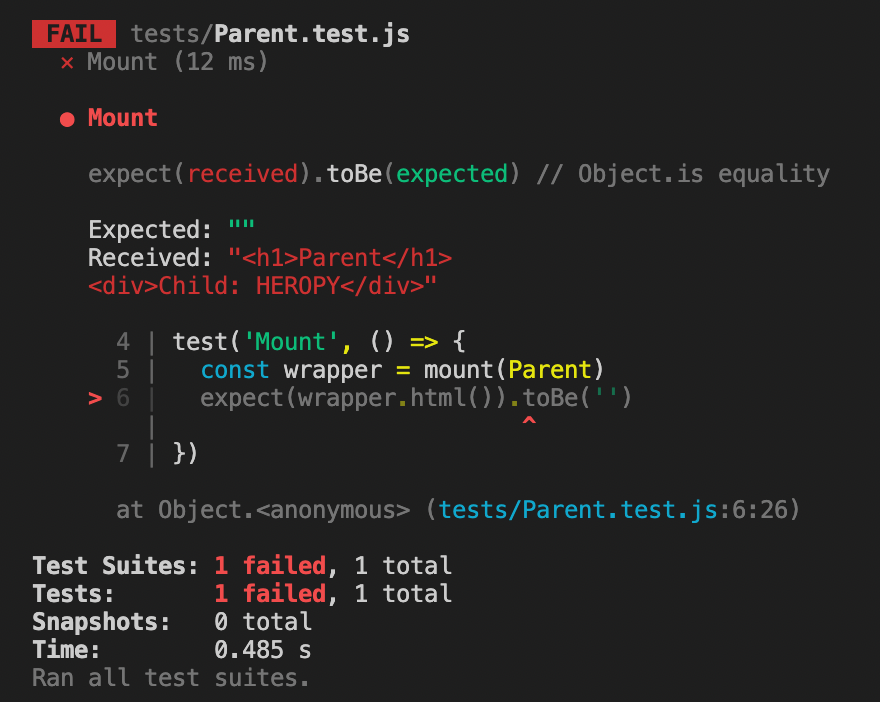
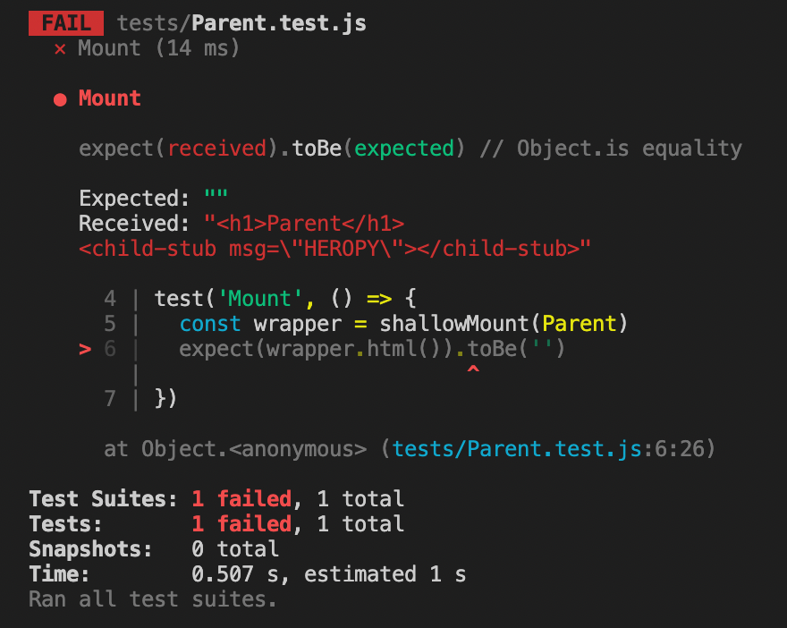

## mount / shallowMount

### mount

Parent.vue

```vue
<template>
  <h1>Parent</h1>
  <Child msg="HEROPY" />
</template>

<script>
import Child from './Child'
export default {
  components: {
    Child
  }
}
</script>
```

Child.vue

```vue
<template>
  <div>Child: {{ msg }}</div>
</template>

<script>
export default {
  props: {
    msg: {
      type: String,
      default: ''
    }
  }
}
</script>
```

<br/>

Parent.test.js

- Parent를 가지고 와 html에 빈 공백 문자가 있는지 테스트

```jsx
import { mount } from '@vue/test-utils'
import Parent from './Parent'

test('Mount', () => {
  const wrapper = mount(Parent)
  expect(wrapper.html()).toBe('')
})
```



<br/>

### shallowMount

- 특정한 컴포넌트를 연결하기는 하나 얕게 연결함
- `h1` 태그에 Parent가 출력된 것은 `mount`와 동일하나 `child`라는 컴포넌트가 렌더링되지 않고 태그로만 존재하는 것을 확인 가능
    - child-stub의 `stub`은 mock(모의)이라고 할 수 있음
    - child라는 컴포넌트를 가짜로 출력했다는 것 즉, 화면에 실제로 렌더링하지 않고 가짜 컴포넌트만 출력하여 진짜로 동작하는 것처럼 만들었다는 뜻
- `shallowMount`는 얕은 연결을 통해 특정 컴포넌트에 붙어 있는 다른 컴포넌트들을 렌더링하지 않고 가짜로 연결한다는 개념을 가짐

```jsx
import { shallowMount } from '@vue/test-utils'
import Parent from './Parent'

test('Mount', () => {
  const wrapper = shallowMount(Parent)
  expect(wrapper.html()).toBe('')
})
```



<br/>

### mount와 shallowMount의 차이점

- **mount**
    - 연결하는 모든 특정 컴포넌트에 하위로 연결되어진 다양한 컴포넌트들을 실제로 렌더링하여 결과를 같이 출력한다는 개념
    - 하위로 연결된 컴포넌트에 또 다시 하위로 연결된 컴포넌트까지 함께 출력
    - 연결된 구조가 매우 복잡하다면 하나의 컴포넌트를 테스트하기 위해 하위에 연결된 수많은 컴포넌트까지 가지고 와 테스트해야 하므로 매우 무겁고 오염될 수도 있다는 단점
- **shallowMount**
    - mount와 구조는 같더라도 하나의 컴포넌트만 연결하고 하위의 컴포넌트들은 가짜로 만들어 연결하는 척만 함(stub)
    - 실질적으로 Parent만 연결되는 것
    - 일반적으로 더 권장되는 사용법